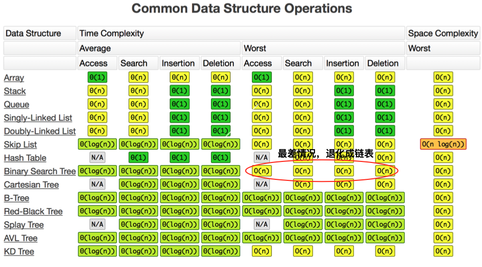
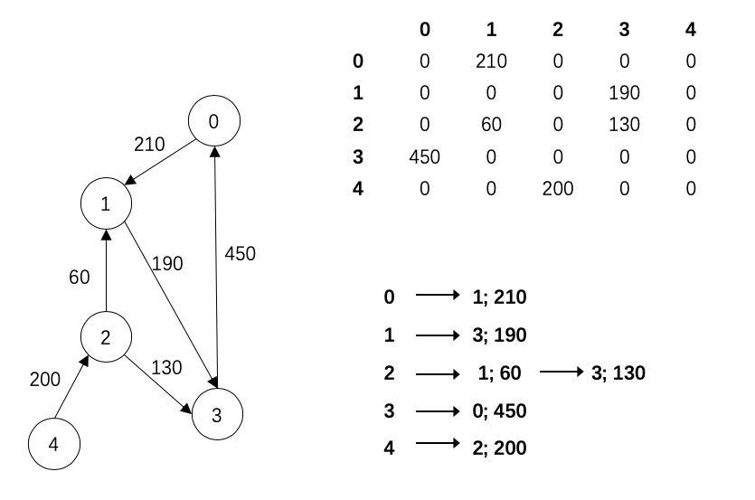

学习笔记
# 一、课程学习内容 
## 1. 树
与链表不一样，每一个结点可以有多个后继结点（子结点），由此形成一种二维层次结构。  
与图相比，树结构中不会形成环。
因此
## 2. 二叉树
树中每一个结点至多只有两个子结点（左右结点）  
二叉树的遍历：
* 前序(Pre-order):根-左-右
* 中序(In-order):左-根-右
* 后序(Post-order):左-右-根  
递归模板：
```
def preorder(self, root):
    if root: 
        self.traverse_path.append(root.val) 
        self.preorder(root.left) 
        self.preorder(root.right)
def inorder(self, root):
    if root:
        self.inorder(root.left) 
        self.traverse_path.append(root.val) 
        self.inorder(root.right)
def postorder(self, root):
    if root:
        self.postorder(root.left) 
        self.postorder(root.right) 
        self.traverse_path.append(root.val)
```
## 3. 二叉搜索树（Binary Search Tree）
特性：  
* 左子树上**所有结点**的值均小于它的根结点的值;  
* 右子树上**所有结点**的值均大于它的根结点的值;  
* 以此类推:左、右子树也分别为二叉查找树。  
中序遍历是升序遍历。  
 
## 3. 堆
可以迅速在一堆数据中找到最大或最小值的数据结构  
根结点最大的堆叫大顶堆，最小的叫小顶堆  
根据实现方式，可以分为二叉堆和斐波那契堆等。
find-max/find-min: O(1)  
delete-max: O(logn)  
insert/create: O(logn)(二叉堆) / O(1) (斐波那契堆)
## 4. 二叉堆
通过完全二叉树来实现堆（并不是二叉搜索树，二叉搜索树的find-max/find-min是O(logn)）  
大顶堆性质：
* 完全二叉树
* 树中任意结点的值总是>=子结点的值  

实现细节：  
1. 通过数组实现  
2. 若父结点的索引为i，那么左子结点索引是2*i+1，右子结点2*i+2
3. 索引为i的结点，其父结点索引为floor((i-1)/2)

插入 HeapifyUp O(logn)：
1. 新元素插入到堆的尾部（数组末尾）
2. 依次向上调整（与父结点比较）至根

删除最大 HeapifyDown O(logn):
1. 删除堆顶，将堆尾元素替换到顶部
2. 从根部向下调整堆的结构（与左右结点中大的值交换），直至堆尾

## 3. 图
图包含了点和边，可以记为点和边的集合。  
点Vertex：
1. 度（入度和出度）
2. 点之间：是否连通  

边Edge:
1. 有向无向
2. 权重（边长）  

图的表示：邻接矩阵和邻接表  
分类：
1. 无向无权图
2. 无向有权图
无向图的邻接矩阵都是对称的
3. 有向无权图
4. 有向有权图

图的算法：
1. 深度优先搜索（DFS)  
递归写法
```python
visited = set() # 树中不会产生环路，但图会，因此要对已访问结点进行记录
def dfs(node, visited):

    if node in visited:
        return

    visited.add(node)
    # 对当前结点进行处理
    
    for next_node in node.children(): 
        if not next_node in visited:  
            dfs(next_node, visited)     
```

2. 宽度优先搜索（BFS)
```python
def bfs(graph, start, end):
    queue = []
    queue.append([start])
    visited = set()
    while queue:
        node = queue.pop()
        visited.add(node)
        process(node)  
        nodes = generate_related_nodes(node)
        queue.push(nodes)
```
3. [连通图个数](https://leetcode-cn.com/problems/number-of-islands/)
4. [拓扑排序](https://zhuanlan.zhihu.com/p/34871092)
5. [最短路径](https://www.bilibili.com/video/av25829980?from=search&seid=13391343514095937158)
6. [最小生成树](https://www.bilibili.com/video/av84820276?from=search&seid=17476598104352152051)
# 二、思考题
1. 树的面试题解法一般都是递归，为什么？  
因为树的结点定义就是一个递归定义。而且树的结构具有重复性
2. [HeapSort][https://www.geeksforgeeks.org/heap-sort/]
* 从输入数据构建大顶堆。
* 此时堆顶元素最大。将最末尾的元素替换到堆顶，堆大小减1，然后维护堆序。
* 重复以上步骤直至堆大小<=1。
```python
# Python program for implementation of heap Sort 

# To heapify subtree rooted at index i. 
# n is size of heap 
def heapify(arr, n, i): 
	largest = i # Initialize largest as root 
	l = 2 * i + 1	 # left = 2*i + 1 
	r = 2 * i + 2	 # right = 2*i + 2 

	# See if left child of root exists and is 
	# greater than root 
	if l < n and arr[i] < arr[l]: 
		largest = l 

	# See if right child of root exists and is 
	# greater than root 
	if r < n and arr[largest] < arr[r]: 
		largest = r 

	# Change root, if needed 
	if largest != i: 
		arr[i],arr[largest] = arr[largest],arr[i] # swap 

		# Heapify the root. 
		heapify(arr, n, largest) 

# The main function to sort an array of given size 
def heapSort(arr): 
	n = len(arr) 

	# Build a maxheap. 
	for i in range(n//2 - 1, -1, -1): 
		heapify(arr, n, i) 

	# One by one extract elements 
	for i in range(n-1, 0, -1): 
		arr[i], arr[0] = arr[0], arr[i] # swap 
		heapify(arr, i, 0) 

# Driver code to test above 
arr = [ 12, 11, 13, 5, 6, 7] 
heapSort(arr) 
n = len(arr) 
print ("Sorted array is") 
for i in range(n): 
	print ("%d" %arr[i]), 
#[5, 6, 7, 11, 12, 13]
# This code is contributed by Mohit Kumra 
```
注意：
* 这是in-place算法
* heapify的时间复杂度O(logn)，构建堆时间复杂度是O(n)，heap sort整体时间复杂度是O(nlogn)。
3. 有向有权图
 
# 三、做题思考
1. 树：  
树的遍历，递归模板要熟记。非递归可以参考颜色标记法，或用栈来模拟递归过程。
2. 堆：  
通常用于[topK问题][https://leetcode-cn.com/problems/top-k-frequent-elements/solution/python-dui-pai-xu-by-xxinjiee/]。
topK小：构建一个k个数的最大堆，当读取的数小于根节点时，替换根节点，重新塑造最大堆  
topK大：构建一个k个数的最小堆，当读取的数大于根节点时，替换根节点，重新塑造最小堆
3. 图：  
DFS：栈/递归  
BFS：队列


