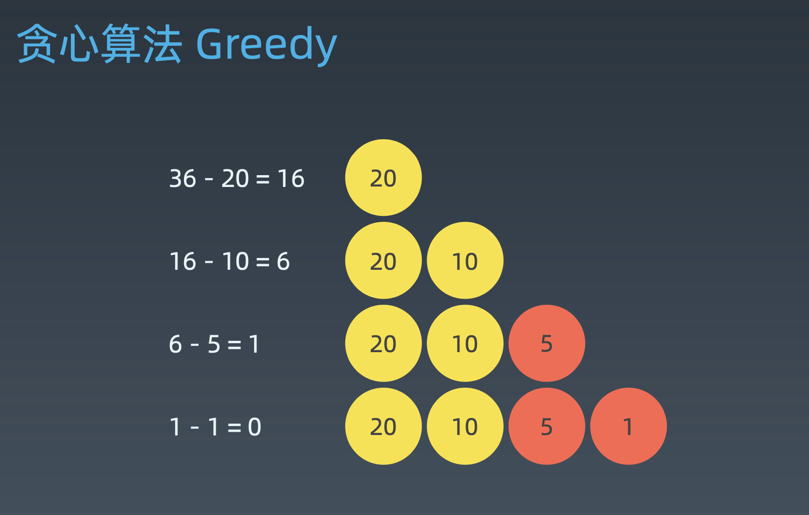
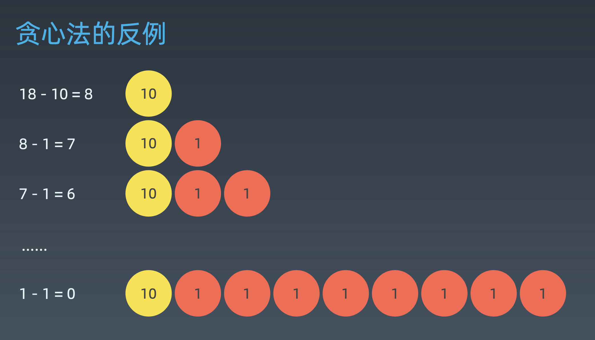
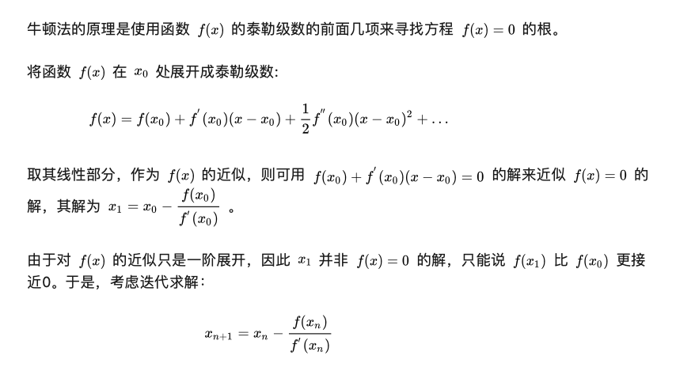

学习笔记
# 深度优先搜索和广度优先搜索
遍历搜索：在树（图/状态集）中寻找特定结点  
* 每个结点都要访问一次
* 每个结点仅要访问一次
* 访问顺序不限：DFS，BFS
## DFS
递归写法：
```python
visited = set()
def dfs(node, visited):
    if node in visited: # terminator
      # already visited
        return
    visited.add(node)
    # process current node here.
    ...
    for next_node in node.children(): 
        if not next_node in visited:
        dfs(next_node, visited)
```
非递归写法：
```python
def DFS(tree):
    if tree.root is None:
        return []
    visited, stack = [], [tree.root]
    while stack:
        node = stack.pop()
        visited.add(node)
        process(node)
        nodes = generated_related_nodes(node)
        stack.push(nodes)
        # other processing work
        ...
```
## BFS
用队列。  
模板：
```python
def BFS(graph, start, end):
    queue = []
    queue.append(start)
    visited.add(start)
    while queue:
        node = queue.pop()
        visited.add(node)
        process(node)
        node = generate_related_nodes(node)
        queue.push(nodes)
        # other processing work
        ...
```
## 题目
### [二叉树的层序遍历](https://leetcode-cn.com/problems/binary-tree-level-order-traversal/%23/description)
* BFS
```python
from collections import deque
class Solution:
    def levelOrder(self, root: TreeNode) -> List[List[int]]:
        if not root:
            return []
        que, result = deque([root]), []
        while que:
            qsize = len(que)
            sub_layer = []
            for _ in range(qsize):
                node = que.popleft()
                if node:
                    sub_layer.append(node.val)
                    que.append(node.left)
                    que.append(node.right)
            if sub_layer:
                result.append(sub_layer)
        return result
``` 
* DFS, 维护(node, level) tuple
```python
class Solution:
    def levelOrder(self, root: TreeNode) -> List[List[int]]:
        if not root:
            return []
        res = []
        def dfs(node, level):
            if len(res) < level:
                res.append([])
            if node:
                res[level-1].append(node.val)
                if node.left:
                    dfs(node.left, level + 1)
                if node.right:
                    dfs(node.right, level + 1)
        dfs(root, 1)
        return res
```
### [括号生成](https://leetcode-cn.com/problems/generate-parentheses/#/description)
* DFS 
```python
class Solution:
    def generateParenthesis(self, n: int) -> List[str]:
        res = []
        def help(cur, left, right):
            if left:
                help(cur + '(', left - 1, right)
            if right > left:
                help(cur + ')', left, right - 1)
            if not right:
                res.append(cur)
        help('', n, n)
        return res
```
* BFS
```python
from collections import deque
class Solution:
    def generateParenthesis(self, n: int) -> List[str]:
        que, res = deque(), []
        que.append(('(', n - 1, n))
        while que:
            cur, left, right = que.popleft() 
            if left == 0 and right == 0:
                res.append(cur)
            if left > 0:
                que.append((cur + '(', left - 1, right))
            if right > left:
                que.append((cur + ')', left, right - 1))
        return res
```
### [最小基因变化](https://leetcode-cn.com/problems/minimum-genetic-mutation/)    
[参考题解](https://leetcode-cn.com/problems/minimum-genetic-mutation/solution/javadan-xiang-yan-du-you-xian-sou-suo-he-shuang-xi/):  
这一题其实和单词接龙问题（单词接龙Ⅰ 、单词接龙Ⅱ）属于一类的问题，都是利用广度优先搜索解决状态图搜索问题。       
* 思路1 单向广度优先搜索  
通过改每个位置上的字母来达到目标的基因排列。  
好在每个位置上的都是有'A', 'C', 'G', 'T'这四个碱基来的，所以我们可以用广度优先搜索，具体步骤如下：  
1 把begin放入队列中  
2 出队一个元素，修改这个元素上第一字母，修改值在剩下的三个字母中选择，都遍历一遍，如果和最后一个元素匹配，那么就退出，返回当前的层级（step）如果修改后的元素在bank的中出现，那么就放入队列中，同时删除bank中的相同的元素。  
3 然后把第一个元素还原原先的字母，然后开始修改第二个字母。执行和第2步一致。
```python
class Solution:
    from collections import deque
    def minMutation(self, start: str, end: str, bank: List[str]) -> int:
        bank = set(bank)
        if not end in bank or not bank:
            return -1
        change_map = {'A':'CGT', 'C':'AGT', 'G':'ACT', 'T':'ACG'}
        que = deque([(start, 0)])
        while que:
            word, step = que.popleft()
            if word == end:
                return step
            for i, c in enumerate(word):
                for s in change_map[c]:
                    new = word[:i] + s + word[i+1:]
                    if new in bank:
                        que.append((new, step + 1))
                        bank.remove(new)
        return -1
```
* 思路2 [DFS](https://leetcode-cn.com/problems/minimum-genetic-mutation/solution/bfsjavashi-xian-by-red010y/)  
1. 从基因库中查看与当前字符串差一个字符的字符串  
2. 可能存在这样的情况，一个字符串已经被访问但是基因库中没有和当前字符串相差1的字符串  
3. 这并不代表基因库中的这个字符串作废，仅仅是针对当前情况失效， 我们必须从已访问中移除，他很可能就是最后和end差1个字符的字符串也未可能
```python
class Solution:
    from collections import deque
    def minMutation(self, start: str, end: str, bank: List[str]) -> int:
        bank = set(bank)
        if not end in bank or not bank:
            return -1
        change_map = {'A':'CGT', 'C':'AGT', 'G':'ACT', 'T':'ACG'}
        min_count, visited = len(bank)+1, set() 
        def dfs(start, step):
            # teminator
            nonlocal min_count
            if step > min_count: # 这一定不会是最短路径
                return 
            if start == end:
                min_count = min(step, min_count)
                return
            for i, c in enumerate(start):
                for s in change_map[c]:
                    new = start[:i] + s + start[i+1:]
                    if new in bank and new not in visited:
                        # drill down
                        visited.add(new)
                        dfs(new, step + 1)
                        # reverse
                        visited.remove(new)
        dfs(start, 0)
        return min_count if min_count <= len(bank) else -1      
```
* 思路3，双向广度优先  
用两个set（一开始是start和end），每次从状态集较少的set开始走，直至相遇
```python
class Solution:
    from collections import deque
    def minMutation(self, start: str, end: str, bank: List[str]) -> int:
        bank = set(bank)
        if not end in bank or not bank:
            return -1
        change_map = {'A':'CGT', 'C':'AGT', 'G':'ACT', 'T':'ACG'}
        start_set, end_set, visited = {start}, {end}, set()
        step = 0
        while start_set:
            step += 1
            new_set = set()
            for word in start_set:
                for i, s in enumerate(word):
                    for c in change_map[s]:
                        new_word = word[:i] + c + word[i+1:]
                        if new_word in end_set:
                            return step
                        if new_word in bank and new_word not in visited:
                            new_set.add(new_word)
                            visited.add(new_word)
            start_set = new_set
            if len(end_set) < len(start_set):
                start_set, end_set = end_set, start_set
        return -1
```
# 贪心算法
贪心算法是一种在每一步选择中都采取在当前状态下最好或最优(即最有利)的选择，从而希望导致结果是全局最好或最优的算法。  

贪心算法与动态规划的不同在于它对每个子问题的解决方案都做出选择，不能回退。动态规划则会保存以前的运算结果，并根据以前的结果对当前进行选择，有回退功能。  
贪心：当下做局部最优判断  
回溯：能够回退  
动态规划：最优判断+回退  
应用：哈夫曼编码、最小生成树  
很多时候，在问题中某一步使用贪心算法，全局再加一个递归搜索或动态规划，已达到全局最优。  
## 例子
### [零钱兑换(修改)](https://leetcode-cn.com/problems/coin-change/)
* 正例，硬币集合有整除关系  
当硬币可选集合固定:Coins = [20, 10, 5, 1], 求最少可以几个硬币拼出总数。 比如 total = 36。  
先用最大的去匹配，然后次大...

* 反例，硬币非整除关系  
非整除关系的硬币，可选集合:Coins = [10, 9, 1] 求拼出总数为 18 最少需要几个硬币?

 ## 贪心算法适用场景
 问题能够分解成子问题来解决，子问题的最优解能递推到最终 问题的最优解。这种子问题最优解称为最优子结构。  
 ## 题目
### [455. 分发饼干](https://leetcode-cn.com/problems/assign-cookies/description/)
* 贪心解法  
对饼干和小朋友都排序，依次用最小的去满足
i指向饼干的指针，j指向小朋友  
若s[i] >= g[j], i,j 都加1  
若s[i] < g[j], i+1, j不动  
```
class Solution:
    def findContentChildren(self, g: List[int], s: List[int]) -> int:
        g.sort()
        s.sort()
        j = 0  # 指向小朋友的指针
        for i in s:
            if j == len(g): break
            if i >= g[j]:
                j += 1
        return j
```
### [122. 买卖股票的最佳时机 II](https://leetcode-cn.com/problems/best-time-to-buy-and-sell-stock-ii/description/)
给定一个数组，它的第 i 个元素是一支给定股票第 i 天的价格。  
设计一个算法来计算你所能获取的最大利润。你可以尽可能地完成更多的交易（多次买卖一支股票）。  
注意：你不能同时参与多笔交易（你必须在再次购买前出售掉之前的股票）。 

 示例 1:   
 输入: [7,1,5,3,6,4]  
输出: 7  
解释: 在第 2 天（股票价格 = 1）的时候买入，在第 3 天（股票价格 = 5）的时候卖出, 这笔交易所能获得利润 = 5-1 = 4 。随后，在第 4 天（股票价格 = 3）的时候买入，在第 5 天（股票价格 = 6）的时候卖出, 这笔交易所能获得利润 = 6-3 = 3 。  

该题可以用回溯、贪心、动态规划等求解。
* 贪心解法  
重要的是想出贪心的思路：只要第二天的价格高于第一天，就可以在第一天买入，第二天卖出。
```
class Solution:
    def maxProfit(self, prices: List[int]) -> int:
        # 贪心解法：只要后一天比前一天大，那么就前一天买，后一天卖
        max_profit = 0
        for i in range(len(prices)):
            if i > 0 and prices[i] > prices[i - 1]:
                max_profit += prices[i] - prices[i - 1]
        return max_profit
```

### [55. 跳跃游戏](https://leetcode-cn.com/problems/jump-game/)
* 穷举/暴力搜索  
按层来进行递归，每一层跳1，2...直到最大的步数，看最大能跳到哪一层，然后从哪一层再往下搜。直到终止条件（最后一层或没有选项）
* 斐波拉契数列，用额外的数组记录状态（第一位为true，其余false），每当到新的一位，将它能到达的位置都改为true。 O(n^2), python超时。
```
class Solution:
    def canJump(self, nums: List[int]) -> bool:
        # 斐波拉契的思路，对于每一个位置，把它所能到达的所有位置都记为True
        if not nums: return False
        reached = [True] + [False] * (len(nums)-1)
        for i in range(len(nums)):
            if reached[i]:
                for step in range(nums[i]+1):
                    if i + step >= len(nums):
                        break
                    reached[i + step] = True
        print(reached)
        return reached[-1]
```
# 二分查找
三个前提条件：  
1. 目标函数单调性(单调递增或者递减)   
2. 存在上下界(bounded)  
3. 能够通过索引访问(index accessible)  
  
代码模板  
```python
left, right = 0, len(array) - 1
while left <= right:
    mid = (left + right) / 2
    if array[mid] == target:
        # find target!
        break or return result
    elif array[mid] < target:
        left = mid + 1
    else:
        right = mid - 1
```
### 例子
#### [69. x 的平方根](https://leetcode-cn.com/problems/sqrtx/)
* 二分查找，y=x^2（x>0)，抛物线在y轴右侧是单调递增的，并且有上下界（0，x）
```python
class Solution:
    def mySqrt(self, x: int) -> int:
        left, right = 1, x # 非负整数的平方根x在1到x之间
        while left <= right:
            mid = (left + right)//2
            if mid * mid > x:
                right = mid - 1
            else:
                left =  mid + 1
        # 不确定返回left还是right的可以都试一下
        return right 
```
* 牛顿迭代法  
参考资料：[牛顿法和拟牛顿法](https://zhuanlan.zhihu.com/p/46536960)，[如何通俗易懂地讲解牛顿迭代法求开方？数值分析？](https://www.zhihu.com/question/20690553)  

回到问题本身，我们要求解x的开方近似，令C = x, 即求解 $x^2 - C = 0$ 的近似解。  
迭代方程 $ x_{n+1} = \dfrac{x_{n}^2 + C}{2x_{n}} $ 
我们由 $x_{0}$ 处开始迭代，直至收敛（$x_{n+1}$与$x_{n}$差小于1e-6）
```python
class Solution:
    def mySqrt(self, x: int) -> int:
        if x == 0: return 0
        C, x0 = float(x), float(x)
        x1 = 0
        while True:
            x1 = (x0 * x0 + C) / (2 * x0)
            if abs(x1 - x0) < 1e-6:
                break
            x0 = x1
        return int(x1)

```
简洁版：
```python
class Solution:
    def mySqrt(self, x: int) -> int:
        r = x
        while (r * r > x):
            r = (r + x/r) // 2
        return int(r)
```
### [33. 搜索旋转排序数组](https://leetcode-cn.com/problems/search-in-rotated-sorted-array/)
1. 暴力，还原 -> 升序 -> 二分 (O(logn))  
2. 二分查找：a. 单调，b. 边界，c. index   
此题目中，不仅仅是比较mid和target，还有看left和mid是否是单调递增的。

[参考题解](https://leetcode-cn.com/problems/search-in-rotated-sorted-array/solution/ji-jian-solution-by-lukelee/)  
简要来说：  
* nums[0] <= nums[mid]（0和mid之间不包含旋转），且nums[0] <= target <= nums[mid]，right向前规约；  
* nums[mid] < nums[0] (0和mid之间包含旋转)，target <= nums[mid]（target在旋转位置和mid之间），right向前规约；  
* nums[mid] < nums[0]（0和mid之间包含旋转），target >= nums[0] >= nums[mid]（target在0到旋转位置之间），right向前规约；  
* 其余情况向后规约。  
```python
class Solution:
    def search(self, nums: List[int], target: int) -> int:
        left, right, mid = 0, len(nums) - 1, 0
        while left <= right:
            mid = (left + right) // 2
            if nums[mid] == target:
                return mid
            elif nums[left] < nums[mid] and nums[mid] >= target >= nums[left]:
                right = mid - 1
            elif nums[left] > nums[mid]:
                if target <= nums[mid] or target >= nums[left]:
                    right = mid - 1
                else:
                    left = mid + 1
            else:
                left = mid + 1
        return -1

```
也就是说nums[mid] < nums[0]，nums[0] > target，target > nums[mid] 三项均为真或者只有一项为真时向后规约。  
原文的分析是：  
注意到原数组为有限制的有序数组（除了在某个点会突然下降外均为升序数组）  
if nums[0] <= nums[i] 那么 nums[0] 到 nums[i] 为有序数组，那么当 nums[0] <= target <= nums[i] 时我们应该在 0−i 范围内查找；  

if nums[i] < nums[0] 那么在 0−i 区间的某个点处发生了下降（旋转），那么 i+1 到最后一个数字的区间为有序数组，并且所有的数字都是小于 nums[0] 且大于 nums[i]，当target不属于 nums[0] 到 nums[i] 时（target <= nums[i] < nums[0] or nums[i] < nums[0] <= target），我们应该在 0−i 区间内查找。

上述三种情况可以总结如下：

    nums[0] <= target <= nums[i]
               target <= nums[i] < nums[0]
                         nums[i] < nums[0] <= target

所以我们进行三项判断：

(nums[0] <= target)， (target <= nums[i]) ，(nums[i] < nums[0])，现在我们想知道这三项中有哪两项为真（明显这三项不可能均为真或均为假（因为这三项可能已经包含了所有情况））

所以我们现在只需要区别出这三项中有两项为真还是只有一项为真。  
使用 “异或” 操作可以轻松的得到上述结果（两项为真时异或结果为假，一项为真时异或结果为真，可以画真值表进行验证）  
两项为真时，结果向前规约；一项为真时，结果向后规约。

之后我们通过二分查找不断做小 target 可能位于的区间直到 low==high，此时如果 nums[low]==target 则找到了，如果不等则说明该数组里没有此项。
```python
from typing import List
class Solution:
    def search(self, nums: List[int], target: int) -> int:

        left, right, mid = 0, len(nums) - 1, 0
        while left < right:
            mid = (left + right) // 2
            if (target >= nums[left]) ^ (target <= nums[mid]) ^ (nums[left] > nums[mid]):
                left = mid + 1
            else:
                right = mid
        return left if left == right and (nums[left] == target) else -1
```
ps：注意边界条件，如right更新是mid-1的话会超出数组范围

# 作业
使用二分查找，寻找一个半有序数组 [4, 5, 6, 7, 0, 1, 2] 中间无序的地方。  

目的：寻找旋转数组中最小值，根据最小值的位置把数组还原。
```python
class Solution:
    def reverseArr(self, nums: List[int]) -> int:
        if not nums: return
        left, right, mid = 0, len(nums) - 1, 0
        while left < right:
            mid = (left + right) // 2
            if nums[mid] < nums[right]:
                right = mid
            else:
                left = mid + 1
        return nums[left:] + nums[0:left]
```
  


