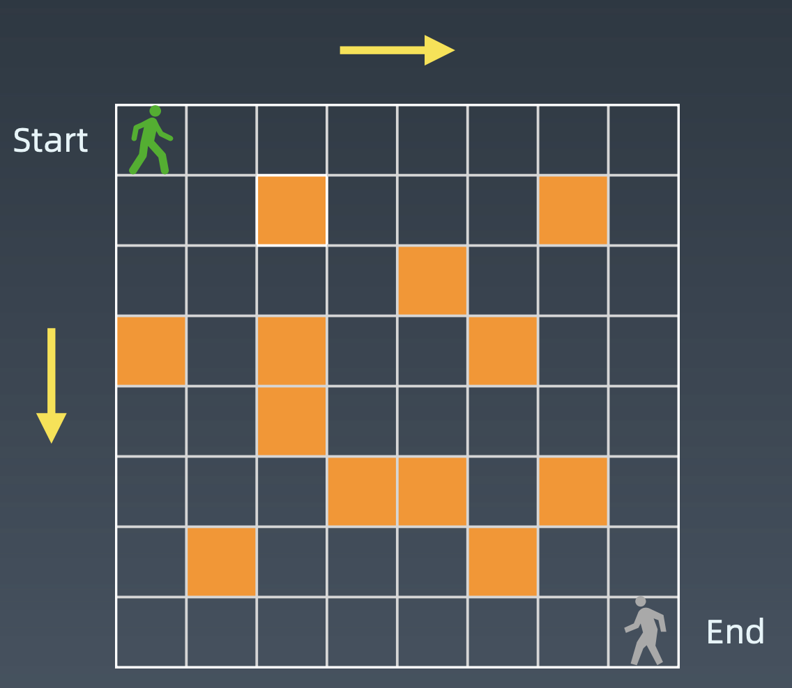
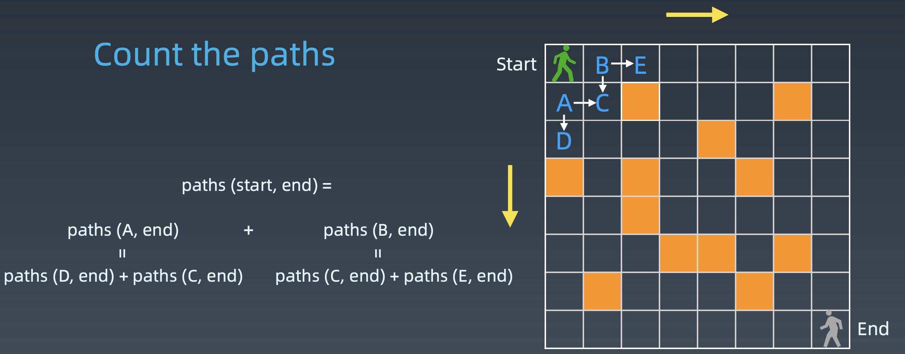
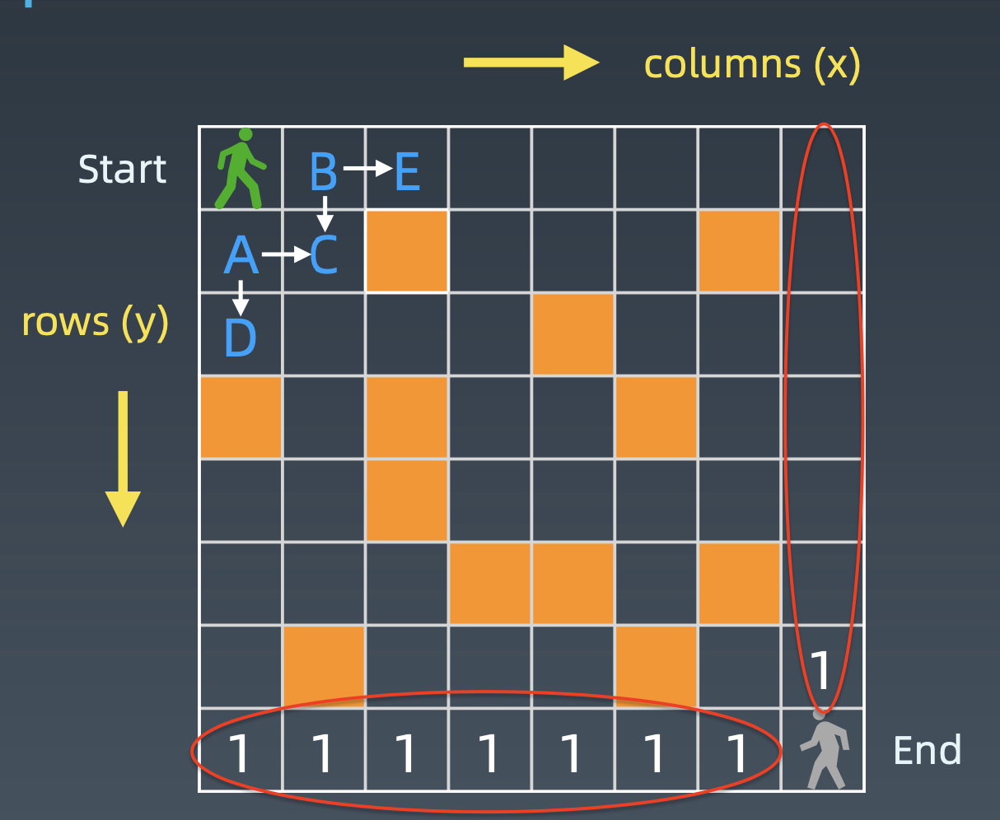
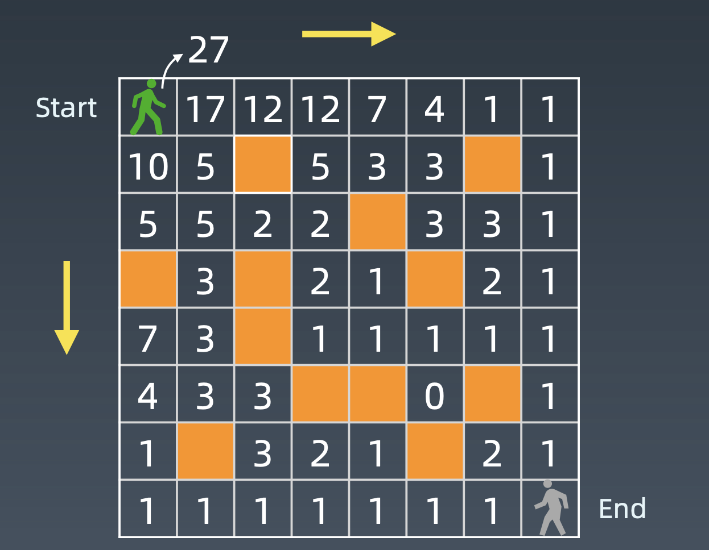
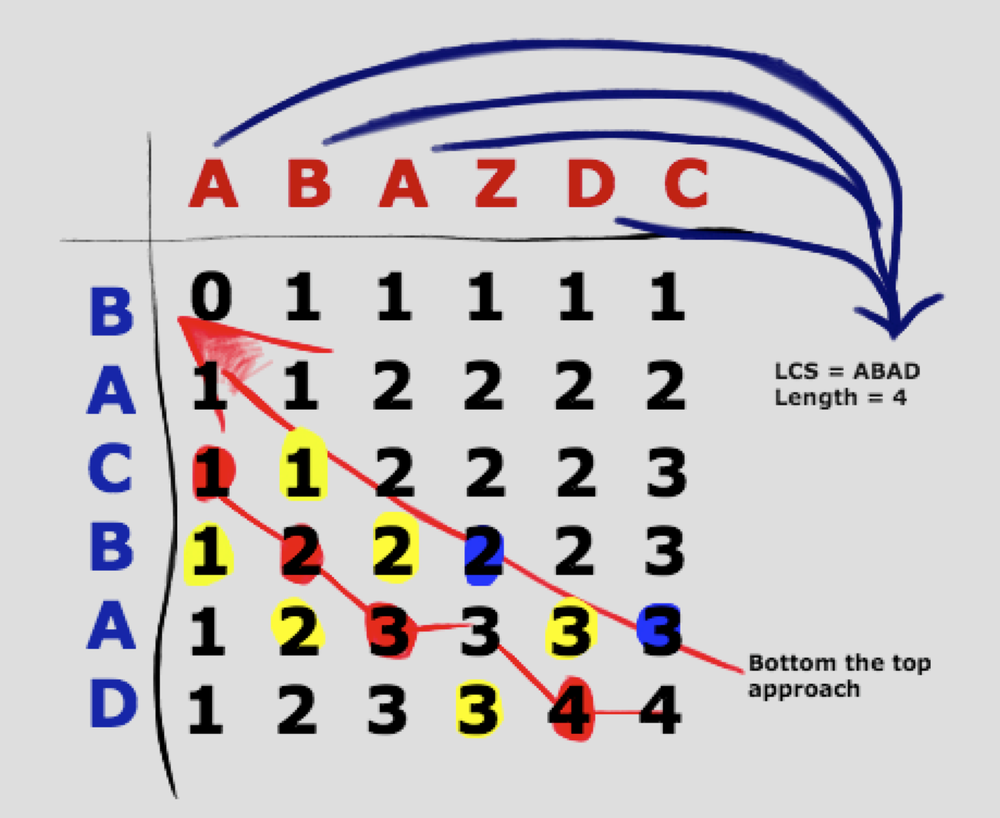
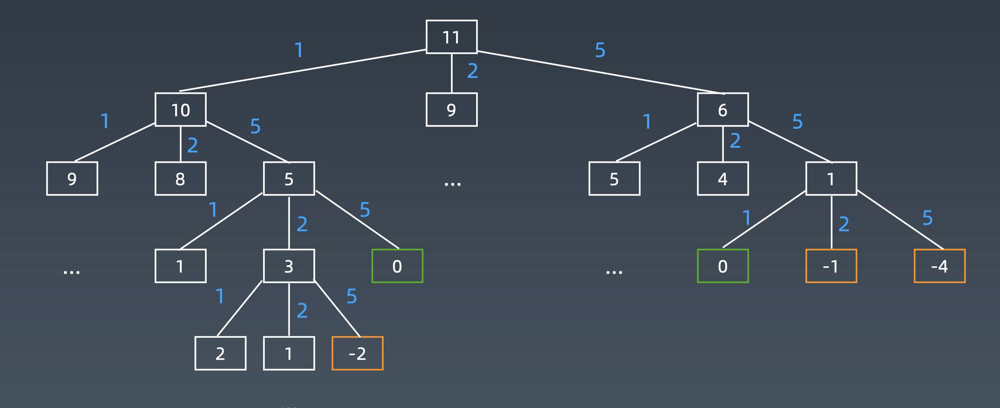

学习笔记
# 动态规划
递归、分治、回溯与动态规划，本质都是寻找问题的重复性-->计算机指令  
## 定义
* [Simplifying a complicated problem by breaking it down into simpler sub-problems in a recursive manner](https://en.wikipedia.org/wiki/Dynamic_programming)
* DP = divide & conquer + optimal substructure (最优子结构)  
一般DP问题都是求最优解、或者最大/最小问题，因此在中间的每一步不需要把所有的状态都保存下来。DP有缓存（状态存储数组），另外在每一步都会把次优的状态给淘汰，只保留这一步里最优或较优的状态来推导全局最优。

**Take home message**
* 动态规划和递归或者分治没有本质上的区别，关键看有无最优子结构  
* 共性：找到重复子问题
* 差异性：最优子结构、中途可以淘汰次优解
## 例题
### Fibonacci数列
* 递归，指数级别（O(2^n)）  
```python
def fib(n):
    if n <= 1: return n
    return fib(n - 1) + fib(n - 2)
```
* memorization，递归+状态化搜索（自顶向下）  
上面递归的情形中，大量结点被重复计算，因此加入一个memory数组记录已被计算过的结点。时间复杂度可从O(2^n)降为O(n)。
```python
def fib(n, memo):
    if n <= 1:
        return n
    if memo[n] == 0:
        memo[n] = fib(n - 1, memo)  + fib(n - 2, memo)
    return memo[n]
```
* **自底向上**（bottom up）
```python
def fib(n):
    a = [0] * (n + 1)
    a[0], a[1] = 0, 1
    for i in range(2, n + 1):
        a[i] = a[i - 1] + a[i - 2]
    return a[n]
```
### 路径计数
* [不同路径](https://leetcode-cn.com/problems/unique-paths/)  
* [不同路径 II](https://leetcode-cn.com/problems/unique-paths-ii/)

   

黄色格子是障碍物，从start走到end，每次只能向右或向下走一步。问共有多少种走法  


思路：  
* 自顶向下  
转化为子问题A和子问题B。先走到A点（子问题A）和先走到B点（子问题B）肯定是两种不同的解法，且从start点出发下一步只能走到A或B，因此子问题A+子问题B组成问题的全部解。    

```python
def countPath(grid, row, col):
    if not validSquare(grid, row, col): return 0
    if isAtEnd(grid, row, col): return 1
    return countPath(grid, row + 1, col) + countPath(grid, row, col + 1) 
```
* 自底向上  


    1. 最下面一行和最右边一列的格子，都只有1种走法；
    2. 对于中间任意一个格子，它的走法 = 它下面格子的走法 + 右边格子的走法；
    3. 障碍物走法：0。
  
    状态转移方差（DP方程）
    ```python
    opt[i, j] = opt[i + 1, j] + opt[i, j + 1]
    ```
    完整逻辑
    ```python
    if a[i, j] == '空地':
          opt[i, j] = opt[i + 1, j] + opt[i, j + 1]
    else:
          opt[i, j] = 0
    ```

    

**Take home message**  
动态规划关键点  
1. 最优子结构，opt[n] = best_of(opt[n - 1], opt[n - 2], ...)  
2. 存储中间状态：opt[i]
3. 递推公式（状态转移方程或DP方程）  
    Fib: opt[i] = opt[n-1] + opt[n-2]  
    二维路径：opt[i, j] = opt[i+1, j] + opt[i, j+1] （且判断是否是空地）
 
### [最长公共子序列](https://leetcode-cn.com/problems/longest-common-subsequence/)
字符串DP时，要将其扩展为一个二维数组来定义状态。  
text1 = "abcde", text2 = "ace" 
1. 暴力法  
枚举text1所有子序列，看是在text2的子序列中。O(2^n)。  
2. DP  
考虑下面三种情况：  
    * s1 = ''  
      s2 = 任意字符串  
      此时公共子序列长度为0
    * s1 = 'A'  
     s2 = 任意字符串   
     此时若s2中包含'A'，则公共子序列长度1.
    * s1 = '....A'  
      s2 = '...A'
      那么s1和s2的最长子序列肯定包含'A'，子问题转化为求s1和s2前面的任意字符串的最长子序列。

  
可以看到和之前的路径计数一致，一开始先初始化第一行和第一列；   
DP方程：
```python
if s1[-1] != s2[-1]:
    LCS[s1, s2] = max(LCS[s1 - 1, s2], LCS[s1, s2 - 1])
if s1[-1] == s2[-1]:
    LCS[s1, s2] = LCS[s1 - 1, s2-1] + 1 
```
### [最小路径和](https://leetcode-cn.com/problems/triangle/description/)
1. 暴力法，递归，n层（left or right）， O(2^n)  
2. DP  
    1. 重复性（分治）：```problem(i, j) = min(problem(i+1, j), problem(i+1, j+1)) + a[i, j]```
    2. 定义状态数组：f[i, j]
    3. DP方程：```f[i, j] = min(f[i+1, j+1], f[i+1, j]) + a[i, j]```

### [53. 最大子序和](https://leetcode-cn.com/problems/maximum-subarray/)
1. 暴力，枚举起点和终点，O(n^2)
2. DP:  
    1. 分治（子问题）  
    **最大子序列和 = 当前元素自身最大 或 包含之前后最大**  
    从后往前，以第i个元素为结尾的最大序列和是：  
    ```
    max_sum(i) = max(max_sum(i - 1), 0) + a[i]
    ``` 
    2. 状态数组: f[i]
    
    3. DP方程:
    ```python
   f[i] = max(f[i - 1], 0) + a[i]
   ```
### [322. 零钱兑换](https://leetcode-cn.com/problems/coin-change/description/) 
因为题目说明**最少**个数，因此有最佳子结构。将这个问题再泛化，问有多少种组合方式，那么可以像爬楼梯的思路。
1. 暴力，递归，O(2^n) （超时）  
```python
class Solution:
    def coinChange(self, coins: List[int], amount: int) -> int:
        # 暴力
        min_count = amount + 1
        res = []
        def help(cur, count):
            if cur == 0:
                res.append(count)
                return 
            for c in coins:
                if c <= cur:
                    help(cur - c, count + 1) 
        help(amount, 0)
        return min(res) if res else -1
```
2. BFS（超时）  
  
找到叶结点为0的结点，且层次最少（BFS）。  
```python
class Solution:
    def coinChange(self, coins: List[int], amount: int) -> int:
        from collections import deque
        if not coins or amount < 0: return -1
        que = deque([amount])
        level = 0
        while que:
            qsize = len(que)
            for _ in range(qsize):
                node = que.popleft()
                if node == 0:
                    return level
                for coin in coins:
                    if coin > node:
                        continue
                    que.append(node - coin)
            level += 1
        return -1
```
3. DP 
    1. subproblem
    2. DP数组  
    爬楼梯问题：`f(n) = f(n - 1) + f(n - 2)`  
    本题转变为：`f(n) = min(f(n - k)  for k in [1, 2, 5])`
    3. DP方程
 ```python
class Solution:
    def coinChange(self, coins: List[int], amount: int) -> int:
        dp = [amount + 1] * (amount + 1)
        dp[0] = 0
        for i in range(1, amount + 1):
            for coin in coins:
                if coin <= i:
                    dp[i] = min(dp[i - coin] + 1, dp[i]) 
        return dp[amount] if dp[amount] <= amount else -1
```
### [198. 打家劫舍](https://leetcode-cn.com/problems/house-robber/)  
DP解法：  
1. 子问题
2. DP数组  
假设用`a[i]`表示偷到第 i 个房子时，最大可以偷到的金额。  
那么`a[i] = a[i - 1] + nums[i]`无法递推，因为我们不知道 i - 1 个房子偷了没有。  
因此我们需要再加一维信息，表示第 i 个房子有没有偷：  
`a[i][0, 1]: 0：不偷，1：偷`   
假设第 i 个房子不偷： `a[i][0] = max(a[i-1][0], a[i-1][1])`  
第 i 个房子要偷：`a[i][1] = a[i-1][0] + nums[i]`  
3. DP方程
```python
class Solution:
    def rob(self, nums: List[int]) -> int:
        # 第一个元素表示不偷第i家，当前最大的金额
        # 第二个元素表示偷第i家，当前最大的金额
        if not nums: return 0
        dp = [0, 0]
        dp[1] = nums[0]
        print(dp)
        for i in range(1, len(nums)):
            dp[0], dp[1] = max(dp[0], dp[1]), dp[0] + nums[i]
            print(dp)
        return max(dp)
```
将上述状态定义改为：`a[i]`，第 i 个能偷到的最大值，返回 max(a)   
那么，`a[i] = max(a[i - 1], nums[i] + a[i  -2])`
```python
class Solution:
    def rob(self, nums: List[int]) -> int:
        if not nums: return 0
        if len(nums) == 1: return nums[0]
        dp = [0] * len(nums)
        dp[0], dp[1] = nums[0], max(nums[0], nums[1])
        res = max(dp[0], dp[1])
        for i in range(2, len(nums)):
            dp[i] = max(dp[i  -1], dp[i - 2] + nums[i])
            res = max(res, dp[i])
        return res
```