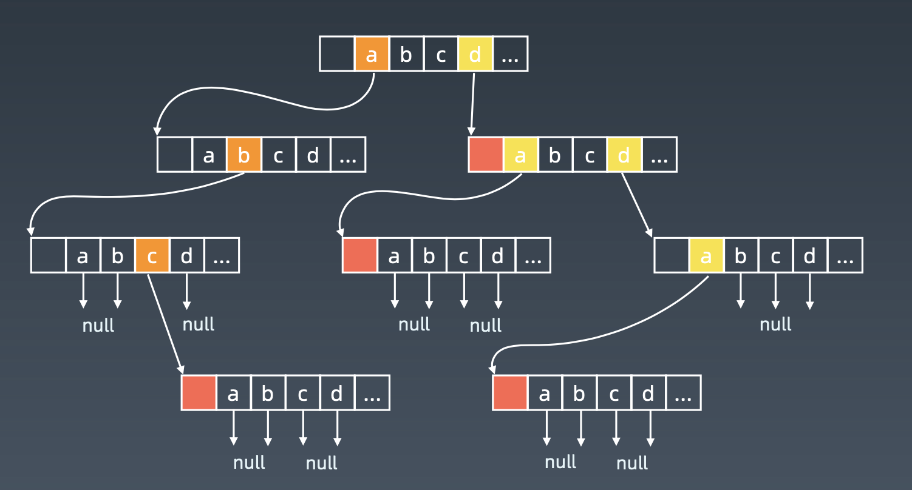
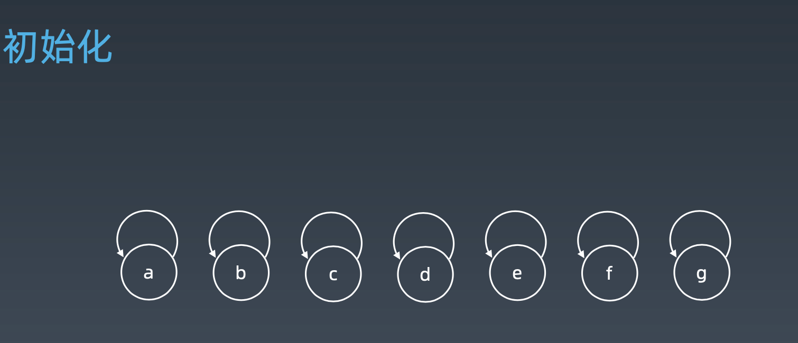
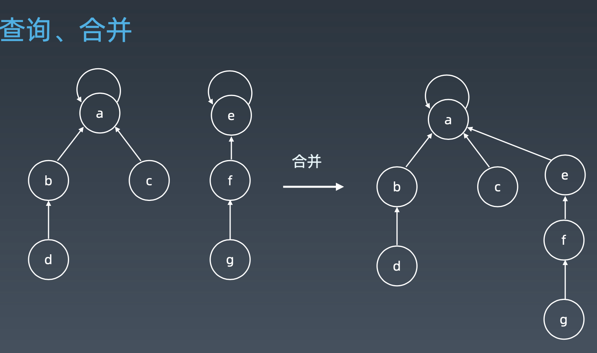
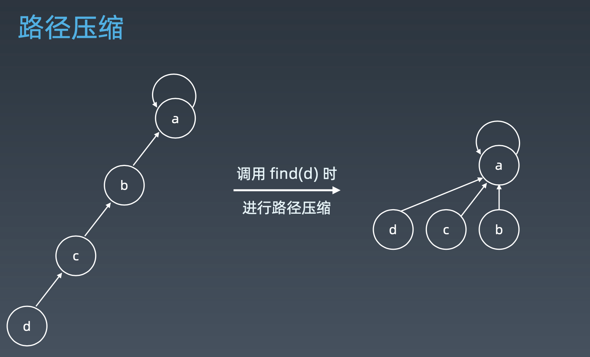
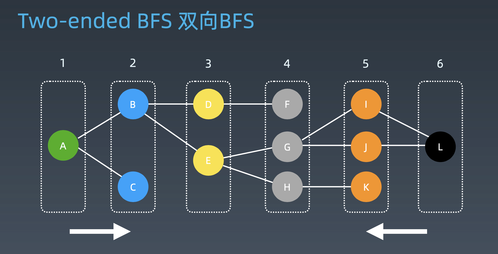

学习笔记
# 字典树（Trie树）
字典树，即 Trie 树，又称单词 查找树或键树，是一种树形结 构。典型应用是用于统计和排 序大量的字符串(但不仅限于 字符串)，所以经常被搜索引 擎系统用于文本词频统计。 
 
它的优点是:最大限度地减少 无谓的字符串比较，查询效率比哈表高。

## 基本性质
1. 结点本身不存完整单词，只存下一个字符;  
2. 从根结点到某一结点，路径上经过的字符连接起来，为该结点对应的字符串;
3. 每个结点的所有子结点路径代表的字符都不相同。

结点可以存储额外的信息，如单词频次；  
结点内部实现：  


**核心思想**：
* 空间换时间  
* 利用字符串的公共前缀来降低查询时间的开销以达到提高效率的目的。  

## [实现代码](https://leetcode-cn.com/problems/implement-trie-prefix-tree/)
```python
class Trie:
    def __init__(self):
        """
        Initialize your data structure here.
        """
        self.root = {}
        self.end_of_word = '#'

    def insert(self, word: str) -> None:
        """
        Inserts a word into the trie.
        """
        node = self.root
        for char in word:
            node = node.setdefault(char, {})
        node[self.end_of_word] = self.end_of_word


    def search(self, word: str) -> bool:
        """
        Returns if the word is in the trie.
        """
        node = self.root
        for char in word:
            if char not in node:
                return False
            node = node[char]
        return self.end_of_word in node

    def startsWith(self, prefix: str) -> bool:
        """
        Returns if there is any word in the trie that starts with the given prefix.
        """
        node = self.root
        for char in prefix:
            if char not in node:
                return False
            node = node[char]
        return True
```
## 题目
### [212. 单词搜索 II](https://leetcode-cn.com/problems/word-search-ii/)
1. words中遍历，然后在board中找，O(N * m * m)，最坏O(N * m *m * 4^k)
2. trie
    1. all words --> Trie，prefix
    2. board，DFS
    
    [时间复杂度](https://leetcode-cn.com/problems/word-search-ii/solution/dan-ci-sou-suo-ii-by-leetcode/)：O(M(4⋅3^(L−1)))，其中 M 是二维网格中的单元格数，L 是单词的最大长度。  
    * 计算回溯算法将执行的确切步数是一个棘手的问题。我们为这个问题的最坏情况提供了该步骤的上限。该算法循环遍历二维网格中的所有单元，因此在复杂度公式中我们有 M 作为因子。然后将其归结为每个启动单元所需的最大步骤数（即 4⋅3^(L−1)）。
    * 假设单词的最大长度是 L，从一个单元格开始，最初我们最多可以探索 4 个方向。假设每个方向都是有效的（即最坏情况），在接下来的探索中，我们最多有 3 个相邻的单元（不包括我们来的单元）要探索。因此，在回溯探索期间，我们最多遍历 4⋅3 ^(L−1)
  个单元格。
    * 你可能会想最坏的情况是什么样子。这里有一个例子。想象一下，二维网格中的每个单元都包含字母 a，单词词典包含一个单词 ['aaaa']。这是算法将遇到的最坏的情况之一。


```python
class Solution:
    def findWords(self, board: List[List[str]], words: List[str]) -> List[str]:
        # 构建字典树
        trie = {}
        for word in words:
            node = trie
            for char in word:
                node = node.setdefault(char, {})
            node['#'] = True
        print(trie)
        m, n = len(board), len(board[0])

        def dfs(i, j, node, cur, visited):
            if '#' in node:
                res.add(cur)
                # 此处不可return，
                # 因为可能会有aaa和aaab这样的情况，
                # 第三个a后面可能是接'#'，也可能是'b'
                # 若找到结束符就提前返回，那么会略掉'aaab'这个答案
            for dx, dy in[(-1, 0), (1, 0), (0, -1), (0, 1)]:
                x, y = i + dx, j + dy
                if 0 <= x < m and 0 <= y < n and board[x][y] in node and (x, y) not in visited:
                    dfs(x, y, node[board[x][y]], cur + board[x][y], visited | {(x, y)})
        
        res = set()
        for i in range(m):
            for j in range(n):
                if board[i][j] in trie:
                    dfs(i, j, trie[board[i][j]], board[i][j], {(i, j)})
        
        return list(res)
```

# 并查集

## 适用场景

* 组团、配对问题
* Group or not?   
假设你要判断两个人是不是好友，应该如何实现？  
可能比较容易想到的是用一个set表示这里面的都是这个人的朋友，这时候可能会发现要建很多个set，并且要进行很多合并的操作。  
并查集就是用来解决这样的问题的一种数据结构。

## 基本操作
* makeSet(s)：建立一个新的并查集，其中包含 s 个单元素集合。
* unionSet(x, y)：把元素 x 和元素 y 所在的集合合并，要求 x 和 y 所在
的集合不相交，如果相交则不合并。
* find(x)：找到元素 x 所在的集合的代表，该操作也可以用于判断两个元 素是否位于同一个集合，只要将它们各自的代表比较一下就可以了。  

## 实现
* 初始化

一开始每个元素拥有一个parent数组指向自己，表示自己就是自己的集合  
* 查询、合并

对于一个元素，看它的parent再看它的parent，一直往上，直到parent等于自己的时候说明找到了领头元素；  
合并：parent[e]指向a，或parent[a]指向e（两者操作等价）。
* 路径压缩  


```python
class Disjointset:
    def __init__(self, n):
        p = [i for i in range(n)]

    def union(self, i, j):
        p1 = self.parent(i)
        p2 = self.parent(j)
        self.p[p1] = p2

    def parent(self, i):
        root = i
        while self.p[root] != root:
            root = self.p[root]
        while self.p[i] != i:
            # 路径压缩
            x = i
            i = self.p[i]
            self.p[x] = root
        return root
```
## 题目

### [547. 朋友圈](https://leetcode-cn.com/problems/friend-circles/)

1. DFS/BFS
```python
class Solution:
    def findCircleNum(self, M: List[List[int]]) -> int:
        # BFS/DFS
        # 从学生i找起，访问所有与其有关系的学生j，再从j扩散出去
        def dfs(i):
            for j in range(n):
                if not j in visited and M[i][j] == 1:
                    visited.add(j)
                    dfs(j)
                    
        if not M: return 0
        n = len(M)
        visited, count = set(), 0
        for i in range(n):
            if i not in visited:
                dfs(i)
                count += 1
        
        return count
```

2. 并查集
```python
class Solution:
    def findCircleNum(self, M: List[List[int]]) -> int:
        # 1. 创建并查集
        if not M: return 0
        n = len(M)
        p = [i for i in range(n)]
        for i in range(n):
            for j in range(n):
                if M[i][j]:
                    # 2. 合并
                    self._union(p, i, j)
        # 3. 统计
        return len(set(self._parent(p, i) for i in range(n)))

    def _union(self, p, i, j):
        p1 = self._parent(p, i)
        p2 = self._parent(p, j)
        p[p1] = p2

    def _parent(self, p, i):
        root = i
        while root != p[root]:
            root = p[root]
        while p[i] != i:
            x = i
            i = p[i]
            p[x] = root
        return root  
```

# 高级搜索

初级搜索：  
* 朴素搜索
* 优化方式：不重复(fibonacci)、剪枝(生成括号问题)
* 搜索方向：深度优先搜索、广度优先搜索  

## 剪枝

### 题目
#### [70. 爬楼梯]
#### [22. 括号生成]
#### [51. N皇后]
#### [36. 有效的数独](https://leetcode-cn.com/problems/valid-sudoku/description/)
```python
class Solution:
    def isValidSudoku(self, board: List[List[str]]) -> bool:
        # 有效，在每行每列或每个方形中数字只出现一次
        rows =  [{} for i in range(9)]
        collumns =  [{} for i in range(9)]
        boxes =  [{} for i in range(9)]

        for i in range(9):
            for j in range(9):
                if board[i][j] != '.':
                    num = int(board[i][j])
                    box_index = (i // 3) * 3 + j // 3
                    rows[i][num] = rows[i].get(num, 0) + 1
                    collumns[j][num] = collumns[j].get(num, 0) + 1
                    boxes[box_index][num] = boxes[box_index].get(num, 0) + 1
                    if rows[i][num] > 1 or collumns[j][num] > 1 or boxes[box_index][num] > 1:
                        return False
        return True
```
#### [37. 解数独](https://leetcode-cn.com/problems/sudoku-solver/#/description)
回溯与剪枝
```python
class Solution:
    def solveSudoku(self, board: List[List[str]]) -> None:
        """
        Do not return anything, modify board in-place instead.
        """
        rows = [set(range(1, 10)) for _ in range(9)] # 初始化可以用来填空的数字
        cols = [set(range(1, 10)) for _ in range(9)]
        boxes = [set(range(1, 10)) for _ in range(9)]

        empty = [] # 记录需要填空的位置
        for i in range(9):
            for j in range(9):
                if board[i][j] != '.':
                    num = int(board[i][j])
                    rows[i].remove(num)
                    cols[j].remove(num)
                    boxes[i // 3 * 3 + j // 3].remove(num)
                else:
                    empty.append((i, j))
        
        def backtrack(index = 0):
            if index == len(empty):
                return True
            i, j = empty[index]
            b = i // 3 * 3 + j // 3
            for num in rows[i] & cols[j] & boxes[b]:
                rows[i].remove(num)
                cols[j].remove(num)
                boxes[b].remove(num)
                board[i][j] = str(num)
                if backtrack(index + 1):
                    return True
                rows[i].add(num)
                cols[j].add(num)
                boxes[b].add(num)
            return False
        
        backtrack(0)
```
# 双向BFS
  
既从A向右边扩散，也从L向左边扩散，直至扩散的结点有重合的地方。把左边扩散的步数加上右边扩散的步数就是总步数。  

模板：
```python
def twoEndBFS(graph, start, end):
    front = [start]
    back = [end]
    visited = set()
    while front:
        next_level = []
        for node in front:
            visited.add(node)
            nodes = generate_related_nodes(node)
            if nodes in back:
                return
            next_level.append(nodes)

        front = next_level
        if len(back) < len(front):
            front, back = back, front
```

## 题目

### [127. 单词接龙](https://leetcode-cn.com/problems/word-ladder/)
1. BFS
```python
from collections import defaultdict, deque
class Solution:
    def ladderLength(self, beginWord: str, endWord: str, wordList: List[str]) -> int:
        # BFS 
        if not wordList or not endWord in wordList: return 0
        que = deque([(beginWord, 0)])
        wordList = set(wordList)
        visited = set([beginWord])
        level = 0
        while que:
            cur_word, step = que.popleft()
            if cur_word == endWord:
                return step + 1
            for i in range(len(cur_word)):
                for char in range(ord('a'), ord('z') + 1):
                    if char == cur_word: continue
                    new_word = cur_word[:i] + chr(char) + cur_word[i+1:]
                    if new_word not in visited and new_word in wordList:
                        visited.add(new_word)
                        que.append((new_word, step + 1))
        return 0 
```
2. DFS （超时）
```python
class Solution:
    def ladderLength(self, beginWord: str, endWord: str, wordList: List[str]) -> int:
        # DFS
        if not wordList or not endWord in wordList: return 0
        wordList = set(wordList)
        steps = []
        visited = set()
        def dfs(cur_word, step):
            if cur_word == endWord:
                steps.append(step + 1)
                return
            for i in range(len(cur_word)):
                for char in range(ord('a'), ord('z') + 1):
                    if chr(char) == cur_word[i]: continue
                    new_word = cur_word[:i] + chr(char) + cur_word[i+1:]
                    if new_word not in visited and new_word in wordList:
                        visited.add(new_word)
                        dfs(new_word, step + 1)
                        visited.remove(new_word)
        dfs(beginWord, 0)
        return min(steps) if steps else 0       
```
3. 双向BFS
```python
import string
class Solution:
    def ladderLength(self, beginWord: str, endWord: str, wordList: List[str]) -> int:
        wordList = set(wordList)
        if not wordList or not endWord in wordList: return 0
        front = {beginWord}
        back = {endWord}
        steps = 1
        length = len(beginWord)
        while front:
            steps += 1
            next_level = set()
            for cur in front:
                for i in range(length):
                    for char in string.ascii_lowercase:
                        if char == cur[i]: continue
                        new_word = cur[:i] + char + cur[i+1:]
                        if new_word in back:
                            return steps
                        if new_word in wordList:
                            next_level.add(new_word)
                            wordList.remove(new_word)
            front = next_level
            if len(back) < len(front):
                back, front = front, back
        return 0
```

# 启发式搜索 Heuristic search, A*

```python
def AstarSearch(graph, start, end):
    pq = collections.priority_queue() # 优先级 —> 估价函数
    pq.append([start]) 
    visited.add(start)
    while pq:
        node = pq.pop() # can we add more intelligence here ? visited.add(node)
        process(node)
        nodes = generate_related_nodes(node)
        unvisited = [node for node in nodes if node not in visited] 
        pq.push(unvisited)
```

**评价函数**  
启发式函数: h(n)，它用来评价哪些结点最有希望的是一个我们要找的结点，h(n) 会返回一个非负实数,也可以认为是从结点n的目标结点路径的估 计成本。

启发式函数是一种告知搜索方向的方法。它提供了一种明智的方法来猜测 哪个邻居结点会导向一个目标。

## 题目

### [1091. 二进制矩阵中的最短路径](https://leetcode-cn.com/problems/shortest-path-in-binary-matrix/)
1. BFS
```python
class Solution:
    def shortestPathBinaryMatrix(self, grid: List[List[int]]) -> int:
        # BFS
        que, n = [(0, 0, 2)], len(grid) # que中元素，当前行、列、步数
        if grid[0][0] or grid[-1][-1]:
            return -1
        if n <= 2: return n
        # grid[0][0] = 1
        for i, j, d in que:
            for dx, dy in [(-1, -1), (-1, 0), (-1, 1), (0, -1), (0, 1), (1, -1), (1, 0), (1, 1)]:
                x, y = i + dx, j + dy
                if 0 <= x < n and 0 <= y < n and not grid[x][y]:
                    if x == n - 1 and y == n - 1:
                        return d
                    que.append((x, y, d + 1)) 
                    grid[x][y] = 1
        return -1
```
2. A* 
首先定义估价函数，此处的估价函数是当前点到终点的距离。
```python
from heapq import heappush, heappop
class PriorityQueue:
    def __init__(self, arr = []):
        self.heap = []
        for val in arr:
            heappush(self.heap, (0, val))

    def add(self, value, priority = 0):
        heappush(self.heap, (priority, value))

    def pop(self):
        priority, val = heappop(self.heap)
        return val

    def __len__(self):
        return len(self.heap)

class Solution:
    def shortestPathBinaryMatrix(self, grid):
        print(grid)
        shortest_path = self.a_star_graph_search(
            start              = (0, 0),
            goal_function      = self.get_goal_function(grid),
            successor_function = self.get_successor_function(grid),
            heuristic          = self.get_heuristic(grid)
        )
        if shortest_path is None or grid[0][0] == 1:
            return -1
        else:
            return len(shortest_path)

    def a_star_graph_search(self,
            start,
            goal_function,
            successor_function,
            heuristic
    ):
        visited = set()
        came_from = dict()
        distance = {start: 0}
        frontier = PriorityQueue()
        frontier.add(start)
        # print(frontier.heap)
        while frontier:
            node = frontier.pop()
            if node in visited:
                continue
            if goal_function(node):
                return self.reconstruct_path(came_from, start, node)
            visited.add(node)
            # print(node)
            for successor in successor_function(node):
                frontier.add(
                    successor,
                    priority=distance[node] + 1 + heuristic(successor)
                )
                if (successor not in distance
                        or distance[node] + 1 < distance[successor]):
                    distance[successor] = distance[node] + 1
                    came_from[successor] = node
        return None

    def reconstruct_path(self, came_from, start, end):
        reverse_path = [end]
        while end != start:
            end = came_from[end]
            reverse_path.append(end)
        return list(reversed(reverse_path))

    def get_goal_function(self, grid):
        M = len(grid)
        N = len(grid[0])

        def is_bottom_right(cell):
            return cell == (M - 1, N - 1)

        return is_bottom_right

    def get_successor_function(self, grid):
        def get_clear_adjacent_cells(cell):
            i, j = cell
            return (
                (i + a, j + b)
                for a in (-1, 0, 1)
                for b in (-1, 0, 1)
                if a != 0 or b != 0
                if 0 <= i + a < len(grid)
                if 0 <= j + b < len(grid[0])
                if grid[i + a][j + b] == 0
            )

        return get_clear_adjacent_cells

    def get_heuristic(self, grid):
        M, N = len(grid), len(grid[0])
        (a, b) = goal_cell = (M - 1, N - 1)

        def get_clear_path_distance_from_goal(cell):
            (i, j) = cell
            return max(abs(a - i), abs(b - j))

        return get_clear_path_distance_from_goal
```

### [773. 滑动谜题](https://leetcode-cn.com/problems/sliding-puzzle/)
1. BFS
```python
class Solution:
    def slidingPuzzle(self, board: List[List[int]]) -> int:
        # 表示空格/0处于第几个位置时，下一步它可移动的位置
        pos = {0: [1,3],
               1: [0, 2, 4],
               2: [1, 5],
               3: [0, 4],
               4: [1, 3, 5],
               5: [2, 4]}
        start = ''.join(''.join(map(str, i)) for i in board)
        que, visited = [start], set()
        step = 0
        while que:
            next_level = []
            for node in que:
                visited.add(node)
                if node == '123450':
                    return step
                zero_index = node.index('0')
                for i in pos[zero_index]:
                    tmp = list(node)
                    tmp[i], tmp[zero_index] = tmp[zero_index], tmp[i]
                    next_state = ''.join(tmp)
                    if not next_state in visited:
                        next_level.append(next_state)
            step += 1
            que = next_level
        return -1
```

2. A*，以现有的board和目标board之间的曼哈顿距离作为估价函数
```python
from collections import namedtuple
import heapq, copy
class Solution:
    def slidingPuzzle(self, board: List[List[int]]) -> int:
        self.scores = [0] * 6
        # 目标位置
        goal_pos = {1:(0,0), 2:(0,1), 3:(0,2), 4:(1,0), 5:(1,1), 0:(1,2)}
        for num in range(6):
            self.scores[num] = [[abs(goal_pos[num][0] - i) + abs(goal_pos[num][1] - j) for j in range (3)] for i in range(2)]

        self.moves = {(0, 0): [(0, 1), (1,0)],
                 (0, 1): [(0, 0), (0, 2), (1, 1)],
                 (0, 2): [(0, 1), (1, 2)],
                 (1, 0): [(0, 0), (1, 1)],
                 (1, 1): [(0, 1), (1, 0), (1, 2)],
                 (1, 2): [(0, 2), (1, 1)]}
        Node = namedtuple('Node', ['heuristic_score', 'steps', 'board'])
        heap = [Node(0, 0, board)]
        visited = []
        while heap:
            node = heapq.heappop(heap)
            if self.get_score(node.board) == 0:
                return node.steps
            elif node.board in visited:
                continue
            else:
                for state in self.get_next_states(node.board):
                    if state not in visited:
                        heapq.heappush(heap, Node(node.steps + 1 + self.get_score(state), node.steps + 1, state))
            visited.append(node.board)
        return -1

    def get_score(self, board):
        return sum([self.scores[board[i][j]][i][j] for i in range(2) for j in range(3)])


    def get_next_states(self, board):
        res = []
        if 0 in board[0]:
            r, c = 0, board[0].index(0)
        else:
            r, c = 1, board[1].index(0)
        for x, y in self.moves[(r, c)]:
            tmp = copy.deepcopy(board)
            tmp[r][c], tmp[x][y] = tmp[x][y], tmp[r][c]
            res.append(tmp)
        return res
```
# 高级树、AVL 树和红黑树
二叉搜索树插入时没有维护好，会退化成单链表，造成性能的衰退。   

维持性能的关键：  
1. 保证二维维度! —> 左右子树结点平衡(recursively)
2. Balanced
3. https://en.wikipedia.org/wiki/Self-balancing_binary_search_tree

## AVL树
1. Balance Factor(平衡因子)：  
    是它的左子树的高度减去它的右子树的高度(有时相反)。   
    balancefactor={-1, 0, 1}
2. 通过旋转操作来进行平衡(四种)  
    左旋、右旋、左右旋、右左旋

不足的地方：  
结点需要存储额外信息，且调整次数频繁。  

## 红黑树
红黑树是一种近似平衡的二叉搜索树(Binary Search Tree)，它能够确保**任何一个结点的左右子树的高度差小于两倍**。  
具体来说，红黑树是满足如下条件的二叉搜索树:
* 每个结点要么是红色，要么是黑色
* 根结点是黑色
* 每个叶结点(NIL结点，空结点)是黑色的。
* 不能有相邻接的两个红色结点
* 从任一结点到其每个叶子的所有路径都包含相同数目的黑色结点。
 
## 两者对比
* AVL trees provide **faster lookups** than Red Black Trees because they are **more strictly balanced**.
* Red Black Trees provide **faster insertion and removal** operations than AVL trees as fewer rotations are done due to relatively relaxed balancing.
* AVL trees store **balance factors** or heights with each node, thus requires storage for an integer per node whereas Red Black Tree requires only 1 bit of information per node.
* Red Black Trees are used in most of the language libraries
like map, multimap, multisetin C++ whereas AVL trees are used in databases where faster retrievals are required.

# 课后作业
1. [单词搜索2的时间复杂度](https://leetcode-cn.com/problems/word-search-ii/solution/dan-ci-sou-suo-ii-by-leetcode/)  
    O(M(4⋅3^(L−1)))，其中 M 是二维网格中的单元格数，L 是单词的最大长度。  
    * 计算回溯算法将执行的确切步数是一个棘手的问题。我们为这个问题的最坏情况提供了该步骤的上限。该算法循环遍历二维网格中的所有单元，因此在复杂度公式中我们有 M 作为因子。然后将其归结为每个启动单元所需的最大步骤数（即 4⋅3^(L−1)）。
    * 假设单词的最大长度是 L，从一个单元格开始，最初我们最多可以探索 4 个方向。假设每个方向都是有效的（即最坏情况），在接下来的探索中，我们最多有 3 个相邻的单元（不包括我们来的单元）要探索。因此，在回溯探索期间，我们最多遍历 4⋅3 ^(L−1)
  个单元格。
    * 最坏的情况：想象一下，二维网格中的每个单元都包含字母 a，单词词典包含一个单词 ['aaaa']。这是算法将遇到的最坏的情况之一。
2. 双向BFS模板
```python
def twoEndBFS(graph, start, end):
    front = [start]
    back = [end]
    visited = set()
    while front:
        next_level = []
        for node in front:
            visited.add(node)
            nodes = generate_related_nodes(node)
            if nodes in back:
                return
            next_level.append(nodes)

        front = next_level
        if len(back) < len(front):
            front, back = back, front
```