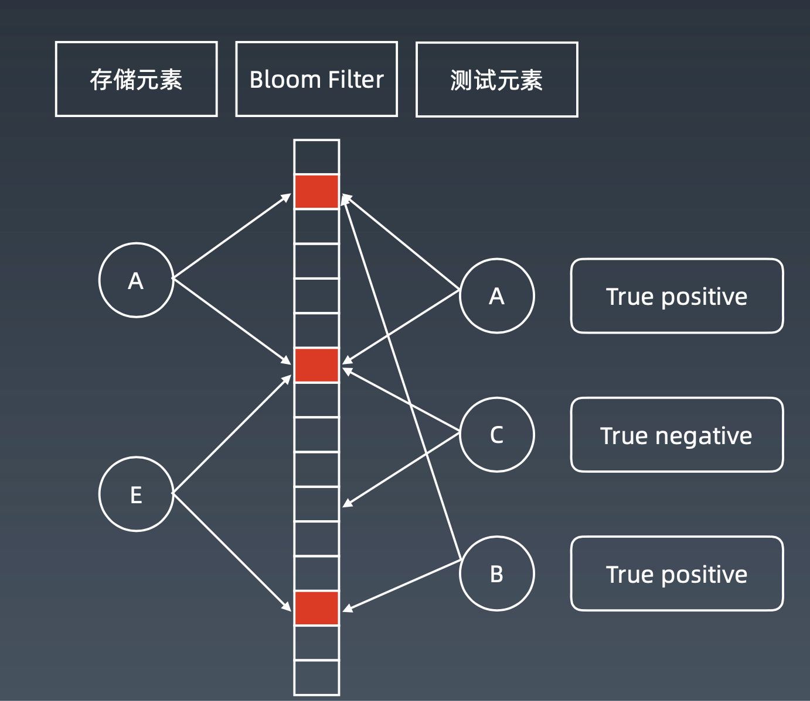

学习笔记

# 位运算
[十进制与二进制转换](https://zh.wikihow.com/从十进制转换为二进制)
1. 左移与右移  
逻辑左移和计算机左移  
计算机左移右移如下：  
移出去的丢掉，补0  

2. 按位运算  

XOR - 异或  
相同为0，不同为1。可用"不进位加法"来理解。  
```
x^0 = x   
x^1s = ~x  (1s 即全1，~0)    
x^(~x) = 1s (x 与 ~x 所有二进制位都不同，所以等于全1）    
x^x = 0   
c = a^b => a^c = b, b^c = a (交换律)  
a^b^c = a^(b^c) = (a^b)^c （结合律）  
```
3. 指定位置的位运算  
  
4. 实战常用位运算
* 判断奇偶  
看这个数的二进制数最后一位是否为0  
`x%2 == 1 --> (x&1) == 1`  
`x%2 == 0 --> (x&1) == 0`  
* 除以2  
`x >> 1 --> x//2`  
右移一位，相当于原数除以2  
`mid = (left + right) // 2 --> mid = (left + right) >> 1`
* 最低位的`1`清零  
`x = x & (x - 1) `
* 得到最低位的`1`  
`x & -x `
* `x & ~x = 0`

## 题目  

### [191. 位1的个数](https://leetcode-cn.com/problems/number-of-1-bits/)

* for loop, count
```python
class Solution:
    def hammingWeight(self, n: int) -> int:
        # bin(n)得到n的二进制字符串
        return bin(n).count('1')
```
* `%2` 看最低位是否为1，然后再 `/2`（把最后一位打掉）(32次)
```python
class Solution:
    def hammingWeight(self, n: int) -> int:
        count = 0
        while n:
            if n % 2 == 1: # n & 1 == 0
                count += 1
            n = n // 2 # n = n>>1
        return count
```
* `x & 1`，最低位判断是0还是1；`x >> 1`（32次）
```python
class Solution:
    def hammingWeight(self, n: int) -> int:
        count = 0
        while n:
            if n & 1 == 0:
                count += 1
            n = n>>1
        return count
```

* `x & (x-1)`是清零最低位的`1`。当`x > 0`，`x = x & (x-1)`  

```python
class Solution:
    def hammingWeight(self, n: int) -> int:
        count = 0
        while n:
            count += 1
            n &= (n - 1)
        return count
```

### [231. 2的幂](https://leetcode-cn.com/problems/power-of-two/)
2的幂次方--> 该数二进制有且仅有一个 `1`：   
`n > 0 and n & (n - 1) == 0`
```python
class Solution:
    def isPowerOfTwo(self, n: int) -> bool:
        return n != 0 and n & (n - 1) == 0
```

### [51. N皇后](#queen1)

使用位运算取代状态数组，加速  
二进制数的每一位代表相应的位置是否可以放。（1没被占用，0被占用）

```python
class Solution:
    def solveNQueens(self, n: int) -> List[List[str]]:
        if n < 1: return []
        self.res = []
        self.dfs(n, [], 0, 0, 0)
        # return self.res
        return [['.' * (i - 1) + 'Q' + '.' * (n - i) for i in res] for res in self.res]

    def dfs(self, n, row, col, pie, na):
        if len(row) == n:
            self.res.append([self.log2(p) for p in row])
            return
        # 记录当前有哪些空格可以放（1可以存，0不可以）
        # 后面与的部分，将超出n的位记为0
        bits = (~(col | pie | na)) & ((1 << n) - 1)
        while bits:
            p = bits & -bits # 取低位的1
            bits = bits & (bits - 1) # 表示在p位置放皇后
            self.dfs(n, row + [p], col | p, (pie | p) << 1, (na | p) >> 1)

    def log2(self, p):
        count = 0
        while p:
            count += 1
            p >>= 1
        return count
```

### [52. N皇后II](https://leetcode-cn.com/problems/n-queens-ii/description/)

```python
class Solution:
    def totalNQueens(self, n: int) -> int:
        if n < 1: return []
        self.count = 0
        self.dfs(n, 0, 0, 0, 0)
        return self.count

    def dfs(self, n, row, col, pie, na):
        if row == n:
            self.count += 1
            return
        # 记录当前有哪些空格可以放（1可以存，0不可以）
        # 后面与的部分，将超出n的位记为0
        bits = (~(col | pie | na)) & ((1 << n) - 1)
        while bits:
            p = bits & -bits # 取最低位的1
            bits = bits & (bits - 1) # 最低位的1变为0, 表示在p位置上放皇后
            # pie左移一位，因为往下一列这个撇往右斜下角多打一位，因此要左移
            # na同理
            self.dfs(n, row + 1, col | p, (pie | p) << 1, (na | p ) >> 1)
```

# 布隆过滤器 Bloom filter  
是由一个**很长的二进制向量**和**一系列随机映射函数**构成。  
布隆过滤器可以用于检索一个元素是否在一个集合中。  
哈希表不仅可以判断是否存在，还可以存元素本身和元素的各种额外信息。  
 
**优点是空间效率和查询时间都远远超过一般的算法。  
缺点是有一定的误识别率和删除困难。**

  
若一个元素对应的二进制位只要有一个为0，说明该元素不在布隆过滤器的索引里。  

但是，一个元素的二进制位都为1，并不说明该元素在索引里。  

对一个测试数据验证其是否在布隆过滤器中：
* 如果对应的二进制位都为1，可能存在
* 不都为1，肯定不在。

案例：  
1. 比特币网络  
2. 分布式系统(Map-Reduce) — Hadoop、search engine  
3. Redis 缓存  
4. 垃圾邮件、评论等的过滤  
科普:https://www.cnblogs.com/cpselvis/p/6265825.html；https://blog.csdn.net/tianyaleixiaowu/article/details/74721877

## 实现
```python
from bitarray import bitarray
import mmh3

class BloomFilter:
    def __init__(self, size, hash_num):
        self.size = size
        self.hash_num = hash_num
        self.bit_array = bitarray(size)
        self.bit_array.setall(0)
    
    def add(self, s):
        for seed in range(self.hash_num):
            result = mmh3.hash(s, seed) % self.size
            if self.bit_array[result] = 0:
                return 'No'
        return 'Probably'
```

# LRU cache（Least Recently Used）  
两个要素：大小、替换策略  
实现方式：hash table + double linkedList  
O(1)查询、修改、更新  


[替换算法](https://en.wikipedia.org/wiki/Cache_replacement_policies)  
LFU - least frequently used   
LRU - least recently used

# 排序


[参考资料](https://www.cnblogs.com/onepixel/p/7674659.html)

1. 比较类排序  
通过比较来决定元素间的相对次序，由于其时间复杂度不能突破
O(nlogn)，因此也称为非线性时间比较类排序。
2. 非比较类排序  
不通过比较来决定元素间的相对次序，它可以突破基于比较排序的时间下界，以线性时间运行，因此也称为线性时间非比较类排序。**一般只能用于整型相关的数据类型**。


## 初级排序 O(n^2)  

### 选择排序 selection sort  

每次找最小值，放到待排序数组的起始位置  

```python
def selectionSort(arr):
    length = len(arr)
    for i in range(length - 1):
        min_index = i 
        for j in range(i + 1, length):
            if arr[j] < arr[min_index]:
                min_index = j
        arr[i], arr[min_index] = arr[min_index], arr[i]
    return arr
```
### 插入排序 insertion sort  

从前往后逐步构建有序序列，对于未排序数据，在已排序序列中从后往前扫描，找到相应位置并插入。  
假设前半部分子数组已经有序，对于后面未排序的数组元素，找出其应该在前面有序数组的什么位置，并插入。  

```python
def insertionSort(arr):
    length = len(arr)
    for i in range(1, length):
        pre_index, cur  = i - 1, arr[i]
        while pre_index >= 0 and arr[pre_index] > cur:
            arr[pre_index + 1] = arr[pre_index]
            pre_index -= 1
        arr[pre_index + 1] = cur
    return arr
```
### 冒泡排序 bubble sort  

嵌套循环，每次查看相邻元素如果逆序，则交换。  
每次排序，最大的元素会被挪到最后。
```python
def bubbleSort(arr):
    length = len(arr)
    for i in range(length - 1):
        for j in range(length - 1 - i):
            if arr[j] > arr[j + 1]:
                arr[j], arr[j + 1] = arr[j + 1], arr[j]
    return arr
```

## 高级排序 O(nlogn)

### 快速排序 quick sort  
基于分治的思想，在数组取标杆 pivot，小于pivot的元素放在它的左边，大于它的元素放在它的右边，然后依次对左边和右边的子数组进行快排。
```python
def quickSort(arr, begin, end):
    def partition(a, begin, end):
        # pivot：标杆位置， counter：小于pivot的元素的个数
        pivot, counter = end, begin
        for i in range(begin, end):
            if a[i] < a[pivot]:
                a[counter], a[i] = a[i], a[counter]
                counter += 1
        a[pivot], a[counter] = a[counter], a[pivot]
        return counter

    if end <= begin: return
    pivot = partition(arr, begin, end)
    quickSort(arr, begin, pivot - 1)
    quickSort(arr, pivot + 1, end)
    return arr
```

### 归并排序 -- 分治

1. 把长度为n的输入序列分为两个长度为n/2的子序列
2. 对这两个子序列分别采用归并排序
3. 将两个排序好的子序列合并成一个最终的排序序列
    
```python
def  mergeSort(arr, left, right):
    def merge(arr, left, mid, right):
        tmp = [0] * (right - left + 1)
        i, j, k = left, mid + 1, 0
        while i <= mid and j <= right:
            if arr[i] <= arr[j]:
                tmp[k] = arr[i]
                i += 1
            else:
                tmp[k] = arr[j]
                j += 1
            k += 1
        while i <= mid:
            tmp[k] = arr[i]
            k += 1; i += 1
        while j <= right:
            tmp[k] = arr[j]
            k += 1; j += 1
        arr[left:left+len(tmp)] = tmp

    if left >= right: return 
    mid = (left + right) >> 1
    mergeSort(arr, left, mid)
    mergeSort(arr, mid + 1, right)
    merge(arr, left, mid, right)
```

### 堆排序 heap sort  

堆插入 O(logn)，取最大/最小值 O(1)  
1. 数组元素依次建立小顶堆
2. 依次取堆顶元素并删除

```python
import heapq
def heapSort(arr):
    heap = arr[:]
    heapq.heapify(heap)
    for i in range(len(arr)):
        arr[i] = heapq.heappop(heap) 
    return arr
```
```python
def heapify(arr, n, i):
    largest = i
    l, r = 2 * i + 1, 2 * i + 2
    if l < n and arr[largest] < arr[l]:
        largest = l
    if r < n and arr[largest] < arr[r]:
        largest = r  
    if largest != i:
        arr[i], arr[largest] = arr[largest], arr[i]
        heapify(arr, n, largest)

def heapSort(arr):
    n = len(arr)
    
    # build a maxheap
    for i in range(n, -1, -1):
        heapify(arr, n, i)

    # 交换元素  
    for i in range(n - 1, 0, -1):
        arr[i], arr[0] = arr[0], arr[i]
        heapify(arr, i, 0)
```

## 特殊排序 O(n)

### 计数排序(Counting Sort) 
 
计数排序要求输入的数据必须是有确定范围的整数。  

将输入的数据值转化为键存储在额外开辟的数组空间中；  
然后依次把计数大于 1 的填充回原数组。


### 桶排序(Bucket Sort)

原理：假设输入数据服从均匀分布，将数据分到有限数量的桶里，每个桶再分别排序(有可能再使用别的排序算法或是以递归方式继续使用桶排序进行排)。  

###基数排序(Radix Sort) 

基数排序是按照低位先排序，然后收集；再按照高位排序，然后再收集；依次类推，直到最高位。  
有时候有些属性是有优先级顺序的，先按低优先级排序，再按高优先级排序。


## 题目

### [493. 翻转对](https://leetcode-cn.com/problems/reverse-pairs/)

1. 暴力求解，两层嵌套

2. merge sort， O(nlogn）  
在进行merge sort的时候，归并时会对左右子数组的大小进行判断，这时加入统计。  
```python
class Solution:
    def reversePairs(self, nums: List[int]) -> int:
        if not nums: return 0
        return self.mergeSort(nums, 0, len(nums) - 1)

    def mergeSort(self, nums, left, right):
        if left >= right: return 0
        mid = (left + right) >> 1
        count = self.mergeSort(nums, left, mid) + self.mergeSort(nums, mid + 1, right)
        cache = [0] * (right - left + 1)
        i, t, c = left, left, 0
        for j in range(mid + 1, right + 1):
            while i <= mid  and nums[i] <= 2 * nums[j]:
                i += 1
            while t <= mid and nums[t] < nums[j]:
                cache[c] = nums[t]
                c += 1; t += 1
            cache[c] = nums[j]
            count += mid - i + 1
            c += 1

        while t <= mid:
            cache[c] = nums[t]
            c += 1; t += 1
        nums[left : right + 1] = cache[:]
        return count
```

3. 树状数组
