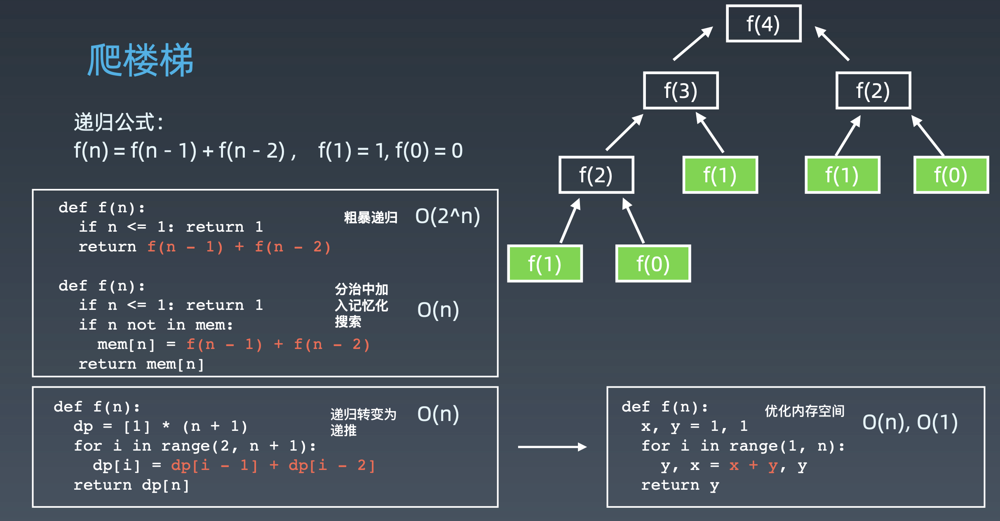
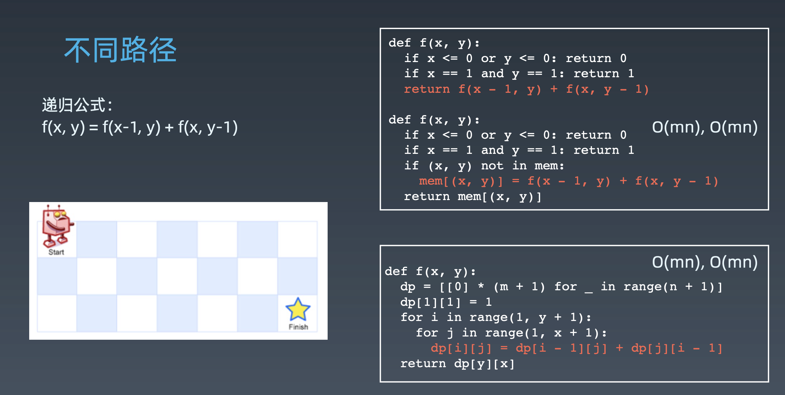
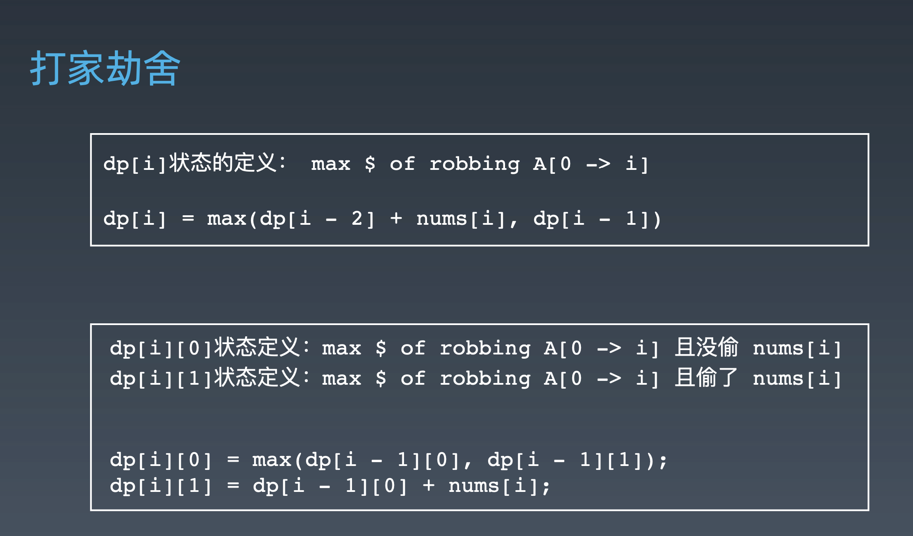
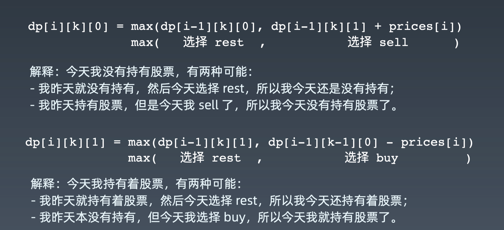
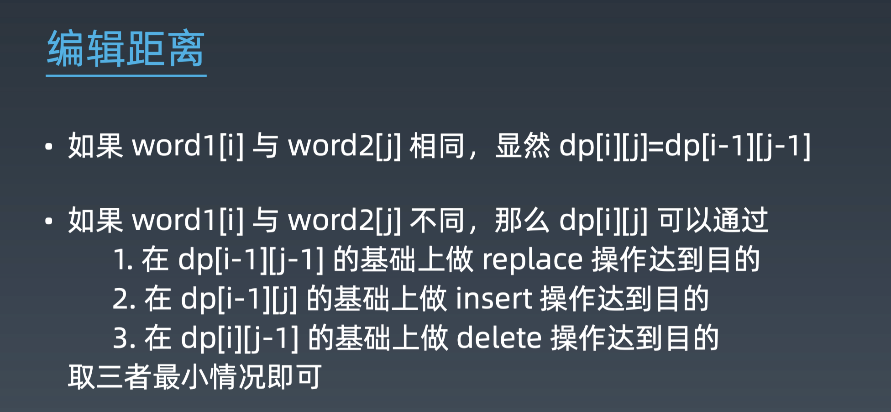
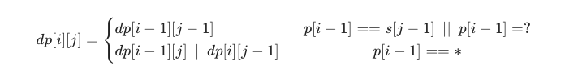

学习笔记

# DP

DP顺推模板
```python
def dp():
    dp = [][] # 可能是一维、二维或者三维的DP数组
    for i in range(M):
        for j in range(N):
            dp[i][j] = _function(dp[i']dp[j'] ...) 
    return dp[M][N]
```
难点要点： 
1. dp状态的定义，需要经验将现实问题定义为dp数组；   
2. 状态转移方程，简单的可能如Fibonacci数列，但是更多情况下，可能会求一个最小值，可能累加累减，或者有一层小循环，从k个数找出最值。  

## 经典题目

### [70. 爬楼梯](https://leetcode-cn.com/problems/climbing-stairs/)
1. 本质上可以转换为Fibonacci问题  
2. 和硬币置换问题有异曲同工之处


### [不同路径](https://leetcode-cn.com/problems/unique-paths/)


### [打家劫舍](https://leetcode-cn.com/problems/house-robber/)
二维DP数组比一维DP数组更容易理解   


### [最小路径和](https://leetcode-cn.com/problems/minimum-path-sum/)
`dp[i][j]`的定义：`minPath(A[1->i][1->j])`

### [股票买卖](https://leetcode-cn.com/problems/best-time-to-buy-and-sell-stock/solution/yi-ge-fang-fa-tuan-mie-6-dao-gu-piao-wen-ti-by-l-3/)
* 每天有不同的股票买卖价格，因此天成为一个状态定义的维度
* 第二个维度，当前是否拥有股票
* 第三个维度，交易次数（不超过K次）
* 冷冻期，类似于偷房子问题


状态数组`dp[i][k][0 or 1] (0 <= i <= n-1, 1 <= k <= K)` 
* i：天数
* k：最多交易次数
* [0, 1]：是否持有股票  
总状态数：n * K * 2
```
for 0 <= i < n:
    for 1 <= k <= K:
        for s in {0, 1}:
            dp[i][k][s] = max(buy, sell, rest)
``` 


# 高阶DP

1. 状态拥有更多维度（二维、三维或者更多，状态空间太大，需要压缩）
2. 状态方程更加复杂

**本质：内功、逻辑、数学能力**
## 题目

### 爬楼梯

1. 可以走`1, 2, ... m`阶几种方式
```python
def climbStairs(n, m):
    if n <= 1:  return n
    a = [0] * (n + 1)
    a[0], a[1] = 1, 1
    for i in range(2, n + 1):
        for j in range(0, m):
            if i - j > 0:
                a[i] += a[i - j - 1]
    return a[n]
```

2. 前后不能走相同的步伐
增加一维：
```python
def climbStairs(n, m):
    if n <= 1: return n
    a = [[0] * m for _ in range(n + 1)]
    # 第二个维度记录最后一步走的是多少级(k-1)台阶
    a[0][0] = 1
    a[1][0] = 1
    for i in range(2, n + 1):
        for j in range(0, m):
            if i - j <= 0: continue
            for k in range(0, m):
                if k == j: continue
                a[i][j] += a[i - j - 1][k]
    return sum(a[n])
```

3. 最小花费走楼梯
```python
from typing import List
class Solution:
    def minCostClimbingStairs(self, cost: List[int]) -> int:
        if not cost: return 0
        N = len(cost)
        if N == 1: return cost[0]
        dp = [0] * (N + 1)
        dp[1] = cost[0]
        for i in range(2, N + 1):
            dp[i] = cost[i - 1] + min(dp[i - 2], dp[i - 1])
        print(dp)
        return min(dp[-1], dp[-2])
```

### [编辑距离](https://leetcode-cn.com/problems/edit-distance/)
1. BFS  
2. DP  

`dp[0...i][0...j]: word1[0...i] 与 word2[...j]之间的编辑距离`    
```
w1: ....x (i)   
w2:  ...x (j)  
w1[i] == w2[j]: edit_dist(i, j) = edit_dist(i-1, j-1)

w1: ...x 
w2:  ..y
w1[i]!=w2[j]:
edit_dist(i, j) = 
min(edit_dist(i-1, j-1) + 1, //把 x 替换为 y 或反过来
    edit_dist(i-1, j) + 1, //把 x 删掉
    edit_dist(i, j-1) + 1 //把 y 删掉)
```

# 字符串

Python
```python
x = 'abc'
x = "abbc"
```
Java
```
String x = "abbc";
```
C++
```
string x("abbc");
```
Python和Java中字符串是不可变（immutable），C++是可变的。

## 遍历字符串
Python
```python
for ch in 'abbc':
    print(ch)
```
Java
```
String x = "abbc";
for (int i = 0; i < x.size(); ++i) {
    char ch = x.charAt(i); 
}
for ch in x.toCharArray() {
    System.out.println(ch); 
}
```
C++
```
string x(“abbc”);
for (int i = 0; i < s1.length(); i++) {
    cout << x[i]; }
```
## 字符串比较
Java：
```
String x = new String("abb");
String y = new String("abb");
x == y --> false
x.equals(y) --> true
x.equalsIgnoreCase(y) --> true
```

## 题目

### 字符串基础
#### [709. 转换成小写字母](https://leetcode-cn.com/problems/to-lower-case/)
位运算：  
* 大写变小写、小写变大写： `^ 32`
* 大写变小写、小写变小写：`| 32`
* 小写变大写、大写变大写： `& -33`
```python
class Solution:
    def toLowerCase(self, str: str) -> str:
        if not str: return ''
        new = ''
        for s in str:
            new_c = chr(ord(s) | 32)
            new += new_c
        return new
```

#### [58. 最后一个单词的长度](https://leetcode-cn.com/problems/length-of-last-word/)
1. 调用python 字符串 split
```python
class Solution:
    def lengthOfLastWord(self, s: str) -> int:
        if not s: return 0
        l = s.split()
        return len(l[-1]) if l else 0
```
2. 从后往前遍历
* 第一种情况，以字符串"Hello World"为例，从后向前遍历直到遍历到头或者遇到空格为止，即为最后一个单词"World"的长度5
* 第二种情况，以字符串"Hello World "为例，需要先将末尾的空格过滤掉，再进行第一种情况的操作，即认为最后一个单词为"World"，长度为5
* 所以完整过程为先从后过滤掉空格找到单词尾部，再从尾部向前遍历，找到单词头部，最后两者相减，即为单词的长度

```python
class Solution:
    def lengthOfLastWord(self, s: str) -> int:
        end = len(s) - 1
        while end >= 0 and s[end] == ' ': end -= 1
        if end < 0: return 0
        start = end
        while start >= 0 and s[start] != ' ': start -= 1
        return end - start
```

#### [387. 字符串中的第一个唯一字符](https://leetcode-cn.com/problems/first-unique-character-in-a-string/)
1. 暴力法  
2. map, O(n)
```python
from collections import Counter
class Solution:
    def firstUniqChar(self, s: str) -> int:
        hm = Counter(s)
        for i, ch in enumerate(s):
            if hm[ch] == 1:
                return i
        return -1
```
3. 字母对应下标

#### [8. 字符串转换整数 (atoi)](https://leetcode-cn.com/problems/string-to-integer-atoi/)
```python
class Solution:
    def myAtoi(self, str: str) -> int:
        s = list(str.strip())
        if len(s) == 0: return 0
        sign = -1 if s[0] == '-' else 1
        if s[0] in ['-', '+']:
            del s[0]
        res, i = 0, 0
        while i < len(s) and s[i].isdigit():
            res = res * 10 + ord(s[i]) - ord('0')
            i += 1
        return max(-2**31, min(sign * res, 2**31-1))
```

### 字符串操作问题

#### [14. 最长公共前缀](https://leetcode-cn.com/problems/longest-common-prefix/description/)
1. 暴力法，从最小的单词开始枚举
2. 两层嵌套   
枚举'f'、'fl' ....  
flower  
flow  
flight   
```python
class Solution:
    def longestCommonPrefix(self, strs: List[str]) -> str:
        if not strs: return ''
        for i in range(len(strs[0])):
            c = strs[0][i]
            for j in range(1, len(strs)):
                if len(strs[j]) == i or strs[j][i] != c:
                    return strs[0][:i]
        return strs[0]
```
3. trie树
```python
class Solution:
    def longestCommonPrefix(self, strs: List[str]) -> str:

        root = dict()
        for s in strs:
            p = root
            for c in s:
                if c not in p:
                    p.setdefault(c, dict())
                p = p.get(c)
            p.setdefault('#')
        p = root
        res = []
        while isinstance(p, dict) and len(p) == 1:
            x, p = p.popitem()
            if x == '#':
                break
            res.append(x)
        return ''.join(res)
```
4. 分治

#### [151. 翻转字符串里的单词](https://leetcode-cn.com/problems/reverse-words-in-a-string/)
1. split, reverse, join  
2. reverse字符串，再单独reverse每个单词

#### [917. 仅仅反转字母](https://leetcode-cn.com/problems/reverse-only-letters/)
```python
class Solution:
    def reverseOnlyLetters(self, S: str) -> str:
        if len(S) == 0: return S
        S = list(S)
        left, right = 0, len(S) - 1
        while left < right:
            if S[left].isalpha() and S[right].isalpha():
                S[left], S[right] = S[right], S[left]
                left += 1; right -= 1
            elif S[left].isalpha():
                right -= 1
            else:
                left += 1
        return ''.join(S)
```

### 异位词
#### [有效字母异位词](https://leetcode-cn.com/problems/valid-anagram/)

#### [字母异位词分组](https://leetcode-cn.com/problems/group-anagrams/)

#### [找到字符串中所有字母异位词](https://leetcode-cn.com/problems/find-all-anagrams-in-a-string/)
类似于滑动窗口，每次出一个单词和进一个单词，使用map来保存。
```python
class Solution:
    def findAnagrams(self, s: str, p: str) -> List[int]:
        need, window = defaultdict(int), defaultdict(int)
        for char in p:
            need[char] += 1
        left, right = 0, 0
        valid = 0
        res = []
        while right < len(s):
            c = s[right]
            right += 1
            if c in need:
                window[c] += 1
                if window[c] == need[c]:
                    valid += 1
            while right - left >= len(p):
                if valid == len(need):
                    res.append(left)
                d = s[left]
                left += 1
                if d in need:
                    if window[d] == need[d]:
                        valid -= 1
                    window[d] -= 1
        return res
```

### 回文串
#### [125. 验证回文串](https://leetcode-cn.com/problems/valid-palindrome/)
```python
class Solution:
    def isPalindrome(self, s: str) -> bool:
        def isDigitAlpha(char: str):
            return char.isdigit() or char.isalpha()

        if len(s) == 0: return True
        s = s.lower()
        left, right = 0, len(s) - 1
        while left < right:
            if isDigitAlpha(s[left]) and isDigitAlpha(s[right]):
                if s[left] != s[right]:
                    return False
                left += 1; right -= 1
            elif isDigitAlpha(s[left]):
                right -= 1
            else:
                left += 1
        return True
``` 

#### [680. 验证回文字符串 Ⅱ](https://leetcode-cn.com/problems/valid-palindrome-ii/)
```python
class Solution:
    def validPalindrome(self, s: str) -> bool:
        def checkPalindrome(left, right):
            while left < right:
                if s[left] != s[right]:
                    return False
                left += 1; right -= 1
            return True

        left, right = 0, len(s) - 1
        while left < right:
            if s[left] == s[right]:
                left += 1; right -= 1
            else:
                return checkPalindrome(left, right - 1) or checkPalindrome(left + 1, right)
        return True
```

## 高级字符串算法

DP，二维数组

### 子串、子序列问题
子序列可以有删除；子串是要连续的
#### [1143. 最长公共子序列](https://leetcode-cn.com/problems/longest-common-subsequence/)
```python
dp[i][j] = dp[i - 1][j - 1] + 1 (if s1[i - 1] == s2[j - 1])
else dp[i][j] = max(dp[i - 1][j], dp[i][j - 1])
```
```python
class Solution:
    def longestCommonSubsequence(self, text1: str, text2: str) -> int:
        if not text1 or not text2: return 0
        m, n = len(text1), len(text2)
        dp =[[0] * (n + 1) for _ in range(m+1)]
        for i in range(1, m + 1):
            for j in range(1, n + 1):
                if text1[i - 1] == text2[j - 1]:
                    dp[i][j] = 1 + dp[i - 1][j - 1]
                else:
                    dp[i][j] = max(dp[i - 1][j], dp[i][j - 1])

        return dp[m][n]
```
#### 最长公共子串
```python
if s1[i-1] == s2[j-1]:
    dp[i][j] = dp[i-1][j-1] + 1  
else: 
    dp[i][j] = 0
```
最后结果在dp数组中找最大值返回。
#### [5. 最长回文子串](https://leetcode-cn.com/problems/longest-palindromic-substring/)
1. 枚举中心，向左右拓展
```python
class Solution:
    def longestPalindrome(self, s: str) -> str:
        def expandFromCenter(s, left, right):
            while left >= 0 and right < len(s) and s[left] == s[right]:
                left -= 1
                right += 1
            return left + 1, right - 1

        start, end = 0, 0
        for i in range(len(s)):
            left1, right1 = expandFromCenter(s, i, i) # 奇数的子串
            left2, right2 = expandFromCenter(s, i, i + 1) # 偶数的子串

            if right1 - left1 > end - start:
                start, end = left1, right1
            if right2 - left2 > end - start:
                start, end = left2, right2
        return s[start:end+1]
```
2. DP  
`dp[i][j] = true s[i:j]是回文子串`
`dp[i][j] = false s[i:j]不是回文子串` 
转移：  
* 如果`i == j` 或 `j - i == 1`，说明子串长度为0或1，肯定是回文串
* `dp[i][j] = (dp[i+1][j-1] & s[i] == s[j])`

```python
class Solution:
    def longestPalindrome(self, s: str) -> str:
        if not s: return ''
        max_substr = ''
        n = len(s)
        dp = [[False] * n for _ in range(n)]
        for i in range(n - 1, -1, -1):
            for j in range(i, n):
                if j == i or (s[i] == s[j] and (dp[i + 1][j - 1] or j-i == 1)):
                    dp[i][j] = True
                    if j - i + 1 > len(max_substr):
                        max_substr = s[i:j+1]
        return max_substr
```

#### [72. 编辑距离](https://leetcode-cn.com/problems/edit-distance/)

### [10. 正则表达式匹配](https://leetcode-cn.com/problems/regular-expression-matching/)
[精选题解](https://leetcode-cn.com/problems/regular-expression-matching/solution/ji-yu-guan-fang-ti-jie-gen-xiang-xi-de-jiang-jie-b/)

**一、热身**  

不管通配符，两个字符串进行比较：
```python
def isMatch(text, pattern):
    if len(text) != len(pattern):
        return False
    for i in range(len(pattern)):
        if pattern[j] != text[j]:
            return False
    return True
```
改成递归：
```python
def isMatch(text, pattern):
    if not pattern: return len(text) == 0
    first_match = (len(text) > 0) and pattern[0] == text[0]
    return first_match and isMatch(text[1:], pattern[1:])
```

二、处理 `.` 通配符  
点号通配符可以匹配任意一个字符。  
`pattern[0]` 要么等于 `text[0]` 或 `'.'`
```python
def isMatch(text, pattern):
    if not pattern: return not text
    first_match = (len(text) > 0) and (pattern[0] in [text[0], '.'])
    return first_match and isMatch(text[1:], pattern[1:])
```

三、处理 `*` 通配符  
`*` 需要和前面一个字符结合起来看：
```python
def isMatch(text, pattern):
    if not pattern: return not text
    first_match = (len(text) > 0) and (pattern[0] in [text[0], '.'])
    if len(pattern) > 2 and pattern[1] == '*':
        # 发现 * 通配符
    else: 
        return first_match and isMatch(text[1:], pattern[1:])  
```
那么需要重复几次呢？在当前情况下，我们只需考虑 0 次、1 次。
```python
def isMatch(text, pattern):
    if not pattern: return not text
    first_match = (len(text) > 0) and (pattern[0] in [text[0], '.'])
    if len(pattern) > 2 and pattern[1] == '*':
        # 如果发现有字符和 '*' 结合
        # 或者匹配该字符 0 次，然后跳过该字符和'*'
        # 或者pattern[0] 和 text[0] 匹配，移动text
        return isMatch(text, pattern[2:]) or (first_match and isMatch(text[1:], pattern))
    else:
        return first_match and isMatch(text[1:], pattern[1:])  
```

四、DP  
加入记忆数组 `memo`，使用两个指针`i`、`j` 记录当前匹配到的位置，从而避免使用字符串切片，并且将`i`、`j` 存入备忘录，避免重复计算。  
```python
class Solution:
    def isMatch(self, s: str, p: str) -> bool:
        memo = dict()
        def dp(i, j):
            if (i, j) in memo: return memo[(i, j)]
            if j == len(p): return i == len(s)
            first = i < len(s) and p[j] in (s[i], '.')
            if j <= len(p) - 2 and p[j + 1] == '*':
                ans = dp(i, j + 2) or (first and dp(i + 1, j))
            else:
                ans = first and dp(i + 1, j + 1)
            memo[(i, j)] = ans
            return ans
        return dp(0, 0)
```
暴力写法：
```python
class Solution:
    def isMatch(self, s: str, p: str) -> bool:
        if not p: return not s
        first = len(s) > 0 and p[0] in {'.', s[0]}
        if len(p) >= 2 and p[1] == '*':
            return self.isMatch(s, p[2:]) or (first and self.isMatch(s[1:], p))
        else:
            return first and self.isMatch(s[1:], p[1:])
```

#### [44. 通配符匹配](https://leetcode-cn.com/problems/wildcard-matching/)
[参考题解](https://leetcode-cn.com/problems/wildcard-matching/solution/zi-fu-chuan-dong-tai-gui-hua-bi-xu-miao-dong-by-sw/)  
**一、状态定义**  
`dp[i][j]`表示 pattern 的前 i 个字符和 s 的前 j 个字符是否匹配  
**二、状态转移**  
* `p[i - 1] == s[j - 1]` 或 `p[i - 1] == '?'`：  
当前字符串匹配，所以 `dp[i][j]` 可从 `dp[i - 1][j - 1]`转移过来  
* `p[i - 1] == '*'`   
这个位置可以匹配 0 到若干个字符。那么 `dp[i][j]` 可以从 `dp[i - 1][j]` 转移过来（当前 * 没有匹配）；  
也可从`dp[i][j - 1]` 转移过来（表明 * 匹配了当前位置的字符）。
  
**三、初始条件**  
`dp[0][0] = true` 空串是匹配的。  
p以若干个 `'*'` 开头的情况，`'*' `是可以匹配空串的。  

```python
class Solution:
    def isMatch(self, s: str, p: str) -> bool:
        rows, cols = len(p), len(s)
        dp = [[False] * (cols + 1) for _ in range(rows + 1)]
        dp[0][0] = True
        for i in range(1, rows + 1):
            if p[i - 1] != '*':
                break
            dp[i][0] = True
        for i in range(1, rows + 1):
            for j in range(1, cols + 1):
                if p[i - 1] == s[j - 1] or p[i - 1] == '?':
                    dp[i][j] = dp[i - 1][j - 1]
                elif p[i - 1] == '*':
                    # 匹配0次，或匹配当前字符
                    dp[i][j] = dp[i - 1][j] | dp[i][j - 1]
        return dp[rows][cols]
```

### [115. 不同的子序列](https://leetcode-cn.com/problems/distinct-subsequences/)
`dp[i][j]`代表 T 的前 i 个字符串可以由 S 的前 j 个字符串组成的最多个数:  
```python
T[i] == S[j], dp[i][j] = dp[i - 1][j - 1] + dp[i][j-1]
T[i] != S[j], dp[i][j] = dp[i][j-1]
```

# 字符串匹配算法
* 暴力法 O(mn)  
[字符串匹配暴力法代码示例](https://shimo.im/docs/8G0aJqNL86wWrPUE)
* Rabin-Karp, 哈希加速暴力法  
[Rabin-Karp 代码示例](https://shimo.im/docs/1wnsM7eaZ6Ab9j9M)
* KMP  
找已经匹配的片段中最大的前缀和最大的后缀  
[字符串匹配的 KMP 算法]([http://www.ruanyifeng.com/blog/2013/05/Knuth–Morris–Pratt_algorithm.html]
)
[KMP 字符串匹配算法视频](https://www.bilibili.com/video/av11866460?from=search&seid=17425875345653862171)